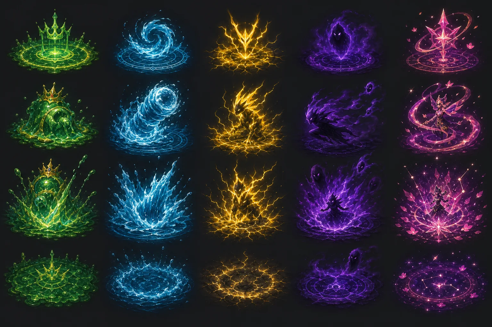

# 몬스터 스킬 VFX 품질 재설계 계획

작성일: 2026-07-23  
상태: 승인 대기 — **이 문서는 계획만 포함하며, 게임 코드·전투 수치·네트워크 판정은 변경하지 않는다.**

## 1. 목표와 판정 기준

목표는 단순히 이펙트를 많이 그리는 것이 아니라, 플레이어 스킬과 동등한 수준으로 아래 네 가지를 동시에 만족시키는 몬스터 전투 연출을 만드는 것이다.

1. 스킬을 쓰기 **전** 어디가 위험한지 한눈에 알 수 있어야 한다.
2. 시전·이동·충돌·잔류가 서로 다른 시각 언어를 가져야 한다.
3. 몬스터 발밑과 목표 지점에 정확히 붙어 보여야 하며, 허공에 떠 보이면 안 된다.
4. 솔로·멀티에서 같은 기술이 같은 타이밍과 위치에 보이되, RTDB 사용량과 프레임 끊김을 늘리지 않아야 한다.

현재 대왕슬라임의 범위 기술은 예고 범위와 충돌의 관계가 명확하고 질량감이 있어 기준점으로 유지한다. 나머지 연출은 범용 이미지 한 장을 확대·회전한 방식과 선 기반 보조 연출이 섞여 있어, 기술의 개성이 약하고 이미지가 떠 보이는 문제가 있다.

## 2. 현재 문제와 즉시 복원할 UX

### 2.1 조준선이 사라진 이유

파이어볼의 흰 조준선 제거 요구와 몬스터의 회피용 조준선이 같은 "선" 처리로 취급되면서, 몬스터 `renderTelegraph`의 외곽선이 제거되었다. 이는 잘못된 결합이다.

- 플레이어 파이어볼: 흰 실선 없이 반투명 범위만 유지한다.
- 몬스터 돌진/직선 기술: 회피를 위한 **색상 있는 조준 레인**을 반드시 유지한다.
- 보스 원형/도넛 기술: 반투명 위험 영역과 속성색 테두리를 반드시 유지한다.

새 구현에서는 조준 정보(`telegraph`)와 장식 효과(`vfx`)를 별도 레이어·별도 모듈로 분리한다. 장식 이미지를 교체해도 회피 판정의 가시성이 사라지지 않게 한다.

### 2.2 조잡하거나 떠 보이는 이유

| 문제 | 원인 | 교체 원칙 |
| --- | --- | --- |
| 선을 여러 번 그은 느낌 | 캔버스 선/원/파티클을 이펙트 본체처럼 사용 | 선은 위험 범위 표시에만 한정하고, 본체는 스프라이트 애니메이션으로 교체 |
| 이미지가 허공에 뜸 | 공통 중심점에 단일 이미지를 배치하고 발 기준점·원근이 없음 | `ground`, `torso`, `target`, `impact` 앵커와 바닥 타원 투영을 데이터로 명시 |
| 모든 몬스터가 비슷함 | 테마만 바꾸고 시퀀스/실루엣은 동일 | 몬스터·기술별 시전/발사/충돌/잔류 프레임을 분리 |
| 조준 정보가 사라짐 | 범위 레이어와 장식 레이어가 결합 | 게임플레이 조준 레이어는 어떤 VFX 로딩 실패에도 독립 렌더 |

## 3. 아트 디렉션 시안

아래 이미지는 런타임에 바로 넣는 에셋이 아니라, 속성별 시전 → 전개 → 충돌 → 잔류의 밀도와 실루엣을 정하기 위한 기준 시안이다. 실제 게임 에셋은 배경 없는 투명 알파 WebP로 별도 제작한다.



왼쪽부터 대왕슬라임(점액/왕관), 물(꼬부기/유적 마임맨), 번개(에몽가/뇌제 피카츄), 그림자(고오스), 별빛(별의 님피아) 계열이다. 이 시안의 광량은 방향성만 참고하며, 실제 게임에서는 흰 섬광 없이 속성색을 중심으로 낮은 알파를 사용한다.

## 4. 목표 구조

### 4.1 분리할 모듈

| 영역 | 책임 | 예정 파일 |
| --- | --- | --- |
| 위험 예고 | 직선·원·도넛의 실제 회피 범위를 그림. 색/두께/점멸만 담당 | `src/js/entities/Monster.js`에서 분리한 `MonsterTelegraphRenderer.js` |
| VFX 아틀라스 캐시 | WebP 로드 1회, 디코드 상태/크기/프레임 메타데이터 보관 | `src/js/effects/EffectAtlasCache.js` |
| 몬스터 기술 VFX | 이벤트 시간으로 프레임을 계산해 caster/impact/residue를 렌더 | `src/js/effects/MonsterSkillVfxRenderer.js` |
| 몬스터 데이터 | 기술별 VFX 시퀀스, 앵커, 크기, z-layer, 저사양 대체 프레임 선언 | `assets/data/monsters/*.json` |
| 검증 | 시트 규격·알파·프레임·앵커·조준선 필수 여부 검사 | `scripts/validate-monster-vfx-atlas.mjs`, `scripts/validate-world-content.js` |

`Monster`는 전투 상태와 네트워크 이벤트만 유지한다. 어떤 이미지 파일을 어디에, 어떤 크기로 그릴지는 렌더러/JSON이 담당한다. 새 몬스터 추가 시 `typeId` 조건문을 늘리지 않고 데이터 행 하나와 에셋만 추가한다.

### 4.2 데이터 스키마 초안

```json
{
  "id": "water_cannon",
  "telegraph": {
    "shape": "line",
    "visible": true,
    "fill": "rgba(52, 196, 255, 0.13)",
    "edge": "#5fe1ff",
    "warningMs": 1100
  },
  "vfx": {
    "sequence": "squirtle_water_cannon",
    "anchors": {
      "cast": "torso",
      "travel": "path",
      "impact": "target",
      "residue": "ground"
    },
    "scale": 1.0,
    "zLayer": "aboveGround",
    "reducedEffects": { "frames": [0, 3, 7], "particleMultiplier": 0 }
  }
}
```

`telegraph.visible`는 안전 규칙이다. 회피 가능한 기술은 false로 만들 수 없으며, 검증 스크립트에서 최소 시전 시간/형태/색상/위험 영역을 확인한다. `vfx`는 피해·범위·지속시간을 변경하지 않는다.

### 4.3 투명 WebP 스프라이트 시트 규격

- 기술 하나당 최대 8프레임: `cast 3~4`, `travel 1~2`, `impact 2`, `residue 1~2`.
- 기본 셀: 256×256, 보스 대형 충돌만 384×384. 각 시트는 4×2 또는 8×1 WebP.
- 모든 모서리 알파는 0이어야 하며, 체커보드·검은 배경·사각형 광원·텍스트는 허용하지 않는다.
- 생성 원본 PNG는 작업 폴더에서만 사용하고 배포 에셋은 품질 82~88의 WebP로 변환한다.
- 시트 메타데이터에 `contentBounds`, 기준 발 위치(`groundAnchorY`), 프레임 시간, 색상 테마를 기록한다.
- 런타임은 `Image`를 시전 순간마다 만들지 않는다. 장면 진입 시 공유 캐시에 한 번 로드하고, 프레임마다 숫자 보간과 `drawImage`만 실행한다.

## 5. 기술별 연출 설계

### 5.1 일반 몬스터

| 몬스터 | 조준 정보 | 시전/이동/충돌/잔류 |
| --- | --- | --- |
| 슬라임·분열 슬라임 | 짧은 초록 직선 레인, 반투명 채움 + 점선 외곽 | 몸체 아래 점액 고임 → 낮은 포물선 돌진 잔상 → 점액 파열 → 0.4초 물방울 소멸 |
| 꼬부기 | 물대포 직선 레인, 끝점 원형 마커 | 등껍질 주변 압축 수류 → 2프레임 물기둥 → 목표 지점 물보라 → 얕은 소용돌이 |
| 에몽가 | 황금 직선 레인, 끝점 전기 마커 | 날개 주변 전하 축적 → 빠른 전기 돌진 → 착지 스파크 → 기존 5초 지지직 지대에 전용 잔류 애니메이션 |
| 고오스 | 목표 뒤쪽의 보라색 포털과 짧은 위험 원 | 현재 위치 연무 수축 → 목표 뒤 포털 개방 → 그림자 기습 충돌 → 혼란 문양 3초. 이동 경로 선은 없음 |

### 5.2 보스

| 보스 | 유지할 장점 | 전용 VFX 시퀀스 |
| --- | --- | --- |
| 대왕슬라임 | 현재의 웅장한 범위 예고/충돌감 | 왕관 룬 → 점액 압축 → 광역 젤리 충격파 → 점액 웅덩이. 기존 범위 스킬을 품질 기준으로 삼음 |
| 유적 마임맨 | 물/거울 계열의 회피형 패턴 | 청록 거울 수면 룬 → 반사 파편/수압 → 동심 수면 폭발 → 유적 균열 위 잔물결 |
| 뇌제 피카츄 | 번개 기술의 빠른 위협성 | 노란 뇌운 구체 → 굵은 분기 전격 → 바닥 균열 낙뢰 → 5초 전기장. 유도탄은 만들지 않음 |
| 별의 님피아 | 별빛/리본의 우아함 | 별자리 마법진 → 리본 궤적 → 꽃잎·별가루 폭발 → 약한 별빛 잔상. 위험 영역은 분홍/보라색으로 독립 표시 |

## 6. 구현 순서

### Phase 0 — 기준 복원과 계측

1. 몬스터 돌진/직선 기술의 색상 조준 레인을 되살린다. 파이어볼의 흰 조준선과 코드를 공유하지 않는다.
2. 현행 `Monster.js`의 범용 이미지 확대·회전 처리와 선 기반 장식 효과를 제거 대상으로 표시한다.
3. 각 기술에 대해 `시전 시작`, `피해 적용`, `잔류 종료` 시간을 캡처하는 개발용 VFX 타임라인을 만든다.

완료 조건: 어떤 에셋이 로드되지 않아도 모든 회피 기술에 조준 정보가 나타나며, 현재 대왕슬라임의 판정/범위는 픽셀 단위로 변하지 않는다.

### Phase 1 — 공통 렌더 파이프라인

1. `MonsterTelegraphRenderer`와 `MonsterSkillVfxRenderer`를 분리한다.
2. 공유 WebP 캐시와 `vfxSequenceId + startAt + seed` 기반의 무할당 프레임 선택을 구현한다.
3. `groundAnchorY`, `contentBounds`, `zLayer`를 반영해 바닥 효과는 캐릭터 아래, 발사체는 위, 충돌 효과는 대상 중심에 배치한다.
4. `useReducedEffects`에서는 같은 조준 정보는 유지하고, VFX 프레임 수/동시 효과 수만 줄인다.

완료 조건: 시전 중 `new Image`, 배열 생성, 랜덤 파티클 생성, RTDB 송신이 발생하지 않는다.

### Phase 2 — 에셋 제작과 적용

1. 위 표의 9종 몬스터에 대해 투명 WebP 8프레임 이하 시트를 제작한다.
2. 생성본은 알파/모서리/가장자리 번짐을 정리한 뒤 WebP로 압축한다.
3. 일반 몬스터 4종을 먼저 적용해 발 위치·직선 레인·원근을 검증한다.
4. 대왕슬라임을 기준 시퀀스로 재구성한 뒤, 3종 필드 보스에 각각 전용 시퀀스를 적용한다.

완료 조건: 동일한 속성이라도 꼬부기와 유적 마임맨, 에몽가와 뇌제 피카츄가 실루엣·박자·잔류 효과로 구분된다.

### Phase 3 — 멀티/성능/접근성 검수

1. 호스트가 보낸 기존 공격 이벤트의 시간·좌표·시드만으로 클라이언트가 같은 VFX를 재생한다. 피해 패킷·보스 텔레그래프 판정은 바꾸지 않는다.
2. 2인 공유 필드에서 한쪽의 보스 시전, 다른 쪽의 입장 중 시전, 호스트 교체 상황을 검증한다.
3. 모바일 세로/가로, 저사양 효과 모드, 별그늘 유적의 어두운 배경에서 조준 정보와 이미지 경계를 점검한다.
4. 10분 자동사냥/최대 일반 몬스터/보스 동시 시전에서 장시간 메모리·프레임 변화를 측정한다.

완료 조건: 이미지가 공중에 뜨거나 사각형 배경이 보이지 않고, 조준 정보가 이펙트에 가려지지 않으며, 장시간 플레이 중 VFX가 원인이 되는 누적 메모리 증가가 없다.

## 7. 검증 체크리스트

- [ ] 모든 회피형 스킬은 시전 시간 전체에 색상 조준 레인/원/도넛을 표시한다.
- [ ] 조준선은 흰 실선이 아니며, 파이어볼 조준 UI와 구현을 공유하지 않는다.
- [ ] 각 WebP 셀의 네 모서리 알파가 0이고, 배경/체커보드/검은 사각형이 없다.
- [ ] `contentBounds`와 `groundAnchorY` 검증을 통과해 바닥 효과가 발밑에 붙는다.
- [ ] 고오스의 기습 포털은 대상 뒤쪽에 보이고, 3초 혼란 판정은 기존과 같다.
- [ ] 에몽가/피카츄의 전기장은 기존 피해 주기·5초 지속시간과 일치한다.
- [ ] 보스 고유 기술의 3배 범위, 2배 위력, 1.3배 시전 시간은 변경하지 않는다.
- [ ] 솔로에서 VFX가 RTDB 읽기/쓰기를 추가하지 않는다.
- [ ] 2인 필드에서 동일한 기술이 중복 피해 없이 양쪽에 재생된다.
- [ ] `npm run validate`와 신규 VFX 에셋/타임라인 검증, 데스크톱·모바일 실기기 캡처를 모두 통과한다.

## 8. 범위 밖 항목

- 몬스터 스탯, 스킬 피해, 쿨다운, 경험치, 드롭률 변경
- 신규 유도탄/피할 수 없는 공격 추가
- 플레이어 파이어볼 수동 조준 UX 변경
- 계정 저장·RTDB 프로필·UI 배치 로직 변경

## 9. 승인 후 산출물

1. 투명 WebP VFX 스프라이트 시트와 JSON 메타데이터
2. 조준 정보/장식 효과가 분리된 렌더 모듈
3. 전 몬스터·보스 적용표와 스크린샷 비교 자료
4. 알파·프레임·성능·멀티 재현을 포함한 자동 검증 스크립트
5. 플레이 테스트 결과와 최종 푸시 커밋

## 10. 구현 기록 (2026-07-23)

- 조준 정보와 장식 VFX의 공용 처리를 분리했다. 플레이어 파이어볼의 흰 조준선은 되살리지 않고, 몬스터 돌진/직선 기술에만 속성색 반투명 레인과 이동 방향 점 표식을 표시한다.
- `src/js/effects/MonsterSkillVfxRenderer.js`를 추가했다. 이미지 인스턴스는 한 번만 생성·재사용하고, 5열×4행 투명 WebP 아틀라스를 시전/돌진/충돌/잔류 프레임으로 선택한다.
- 모든 전투 몬스터의 `visual.effectVfx`에 테마와 하단 고정 앵커를 선언했다. 렌더러는 이미지 중앙이 아니라 하단을 월드 지면 좌표에 고정하므로 기존의 부유·카드형 이미지 문제가 재발하지 않는다.
- 대왕슬라임의 큰 원형 예고와 판정은 유지하고, 나머지 원/도넛/직선 예고에는 새 프레임을 겹친다. 피해, 쿨다운, 범위, 보스 배율, RTDB 이벤트 및 멀티 판정은 변경하지 않았다.
- `npm run validate` 전체 통과. 브라우저 자동 연결은 이 작업 환경에서 사용할 수 없어, 실제 데스크톱/모바일 기기 시각 점검은 배포 후 최종 확인 항목으로 남긴다.
- 성능 재검토에서 렌더 호출당 생성되던 옵션 객체와 프레임 맵을 제거했다. 렌더러는 단일 지연 생성 `Image`만 공유하고, RTDB·저장소·네트워크·시간 기반 애니메이션 상태를 갖지 않도록 자동 검증한다.
