# 🎭 Yurika Online: 서사 중심 게임 디자인 마스터플랜

## Executive Summary

**"A Father's Promise: The Demon King's Daughter"**

이 문서는 기존 Yurika Online의 MMORPG 메커닉에 감정적 서사를 통합하여, 단순한 몬스터 사냥 게임을 **부성애와 희생, 정체성의 혼란**을 다루는 서사적 걸작으로 끌어올리는 포괄적인 설계를 제시합니다.

---

## Part 1: 핵심 서사 구조 (Core Narrative Architecture)

### 1.1 3막 구조와 게임플레이 매핑

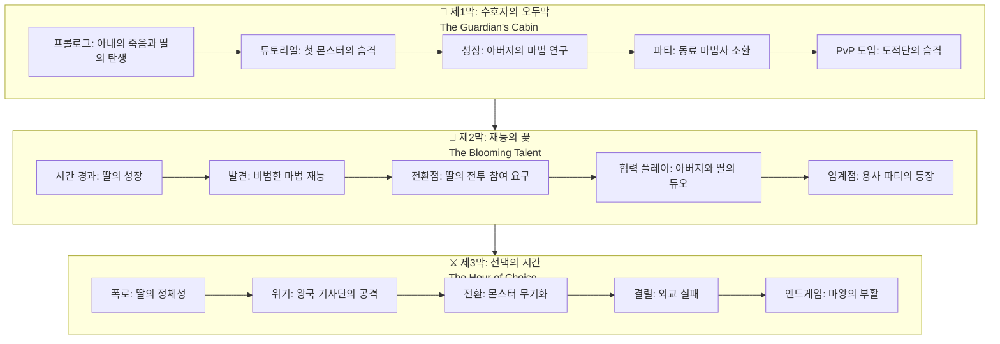
```mermaid
flowchart TB
    subgraph ACT1["🌅 제1막: 수호자의 오두막<br/>The Guardian's Cabin"]
        A1[프롤로그: 아내의 죽음과 딸의 탄생] --> A2[튜토리얼: 첫 몬스터의 습격]
        A2 --> A3[성장: 아버지의 마법 연구]
        A3 --> A4[파티: 동료 마법사 소환]
        A4 --> A5[PvP 도입: 도적단의 습격]
    end
    
    subgraph ACT2["🌱 제2막: 재능의 꽃<br/>The Blooming Talent"]
        B1[시간 경과: 딸의 성장] --> B2[발견: 비범한 마법 재능]
        B2 --> B3[전환점: 딸의 전투 참여 요구]
        B3 --> B4[협력 플레이: 아버지와 딸의 듀오]
        B4 --> B5[임계점: 용사 파티의 등장]
    end
    
    subgraph ACT3["⚔️ 제3막: 선택의 시간<br/>The Hour of Choice"]
        C1[폭로: 딸의 정체성] --> C2[위기: 왕국 기사단의 공격]
        C2 --> C3[전환: 몬스터 무기화]
        C3 --> C4[결렬: 외교 실패]
        C4 --> C5[엔드게임: 마왕의 부활]
    end
    
    ACT1 --> ACT2 --> ACT3
```

### 1.2 서사적 필연성에서 유래한 게임플레이 요소

| 게임플레이 요소 | 서사적 근거 | 감정적 효과 |
|---------------|------------|-----------|
| **몬스터 사냥** | 딸을 지키기 위한 방어전 | 보호 본능의 충족 |
| **성장 시스템** | 아버지의 연구와 수호 의지의 성장 | 성취감 + 서사적 진전 |
| **파티 플레이** | 혼자서는 지킬 수 없음을 인식 | 고독→연대의 전환 |
| **PvP** | 자원을 노린 인간의 탐욕 | 배신감 + 긴장감 |
| **보스 레이드** | 딸의 마왕력이 끌어들인 강력한 존재 | 위기감 + 서사적 중요성 |

---

## Part 2: 감정적 호 아키텍처 (Emotional Hook Architecture)

### 2.1 핵심 감정적 동기: "딸을 지켜라"

모든 게임플레이는 **부성애**라는 단 하나의 감정적 축을 중심으로 회전합니다.

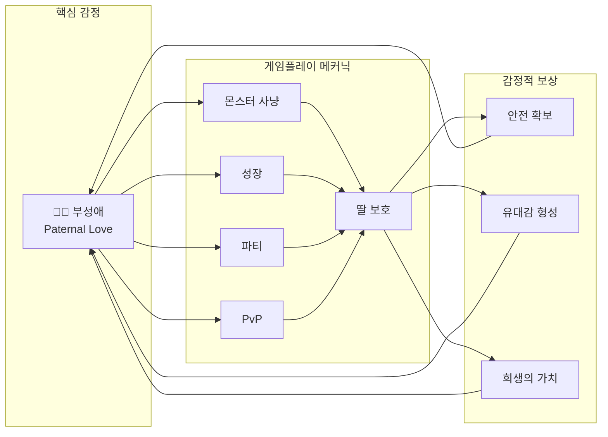
```mermaid
flowchart LR
    subgraph CORE["핵심 감정"]
        FATHER_LOVE["👨‍👧 부성애<br/>Paternal Love"]
    end
    
    subgraph MECHANICS["게임플레이 메커닉"]
        HUNT["몬스터 사냥"] --> PROTECT["딸 보호"]
        GROW["성장"] --> PROTECT
        PARTY["파티"] --> PROTECT
        PVP["PvP"] --> PROTECT
    end
    
    subgraph EMOTIONAL_PAYOFF["감정적 보상"]
        PROTECT --> SAFETY["안전 확보"]
        PROTECT --> BONDING["유대감 형성"]
        PROTECT --> SACRIFICE["희생의 가치"]
    end
    
    FATHER_LOVE --> HUNT
    FATHER_LOVE --> GROW
    FATHER_LOVE --> PARTY
    FATHER_LOVE --> PVP
    
    SAFETY --> FATHER_LOVE
    BONDING --> FATHER_LOVE
    SACRIFICE --> FATHER_LOVE
```

### 2.2 서사적 훅의 3단계 진화

#### 단계 1: 보호 본능 (Act 1)
- **훅**: "내 딸을 건드리지 마"
- **메커닉**: 오두막 중심의 방어전
- **시각적 표현**: 오두막 창문에서 바라보는 딸의 실루엣
- **사운드**: 딸의 울음소리, 자장가 흥얼거림

#### 단계 2: 자부심과 걱정 (Act 2)
- **훅**: "내 딸이 자라고 있어"
- **메커닉**: 딸의 성장과 협력 전투
- **시각적 표현**: 딸이 스스로 마법을 쓰는 모습
- **사운드**: 딸의 "아빠, 나도 할 수 있어!"

#### 단계 3: 수용과 선택 (Act 3)
- **훅**: "네가 누구든, 넌 내 딸이야"
- **메커닉**: 진실 폭로 후에도 딸과 함께하는 선택
- **시각적 표현**: 딸의 눈이 본래의 색에서 마왕의 색으로 변화
- **사운드**: "아빠... 나는..."

### 2.3 장르 전환에도 투자를 유지하는 설계

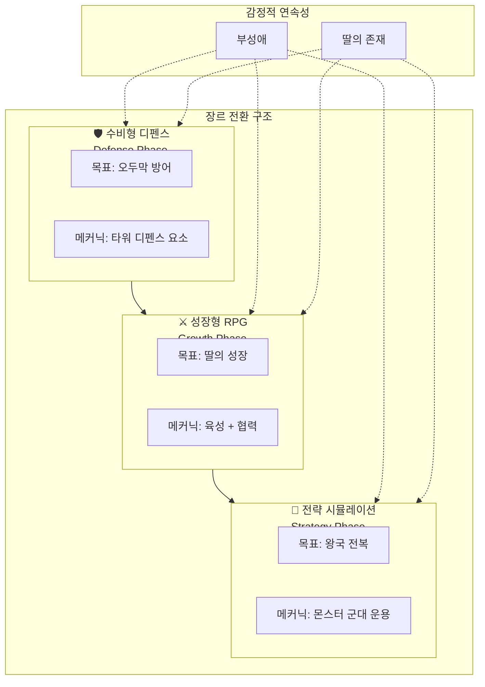
```mermaid
flowchart TB
    subgraph GENRE_TRANSITION["장르 전환 구조"]
        direction TB
        
        subgraph PHASE1["🛡️ 수비형 디펜스<br/>Defense Phase"]
            P1_GOAL["목표: 오두막 방어"]
            P1_MECH["메커닉: 타워 디펜스 요소"]
        end
        
        subgraph PHASE2["⚔️ 성장형 RPG<br/>Growth Phase"]
            P2_GOAL["목표: 딸의 성장"]
            P2_MECH["메커닉: 육성 + 협력"]
        end
        
        subgraph PHASE3["🏰 전략 시뮬레이션<br/>Strategy Phase"]
            P3_GOAL["목표: 왕국 전복"]
            P3_MECH["메커닉: 몬스터 군대 운용"]
        end
        
        PHASE1 --> PHASE2 --> PHASE3
    end
    
    subgraph EMOTIONAL_CONTINUITY["감정적 연속성"]
        LOVE["부성애"] -.-> PHASE1
        LOVE -.-> PHASE2
        LOVE -.-> PHASE3
        
        DAUGHTER["딸의 존재"] -.-> PHASE1
        DAUGHTER -.-> PHASE2
        DAUGHTER -.-> PHASE3
    end
```

---

## Part 3: 서사-기계적 통합 (Narrative-Mechanical Integration)

### 3.1 몬스터 사냥의 서사적 정당화

**기존**: "경험치와 골드를 위해 사냥한다"

**서사적 재정의**: 
> "딸의 마왕력이 주변 마물을 끌어들인다. 
> 사냥은 단순한 성장이 아닌 생존을 위한 방어다."

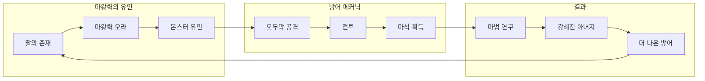
```mermaid
flowchart LR
    subgraph ATTRACTION["마왕력의 유인"]
        DAUGHTER["딸의 존재"] --> AURA["마왕력 오라"]
        AURA --> MONSTERS["몬스터 유인"]
    end
    
    subgraph DEFENSE["방어 메커닉"]
        MONSTERS --> CABIN["오두막 공격"]
        CABIN --> COMBAT["전투"]
        COMBAT --> REWARD["마석 획득"]
    end
    
    subgraph CONSEQUENCE["결과"]
        REWARD --> RESEARCH["마법 연구"]
        RESEARCH --> STRONGER["강해진 아버지"]
        STRONGER --> BETTER_DEFENSE["더 나은 방어"]
    end
    
    BETTER_DEFENSE --> DAUGHTER
```

### 3.2 파티 플레이의 서사적 도입

**핵심 장면**: "혼자서는 부족했다"

```
[게임플레이 흐름]

1. 웨이브 5 이후, 몬스터가 동시에 3방향에서 등장
2. 아버지(플레이어)는 한 방향만 막을 수 있음
3. 오두막 처음으로 피해 입음
4. 딸의 울음소리 + "아빠... 무서워..."
5. 시스템 메시지: "혼자서는 지키기 어렵습니다"
6. 파티 초대 튜토리얼 자동 시작
7. 동료 마법사 NPC 등장 (스토리상 첫 파티원)
```

**파티 메커닉의 서사적 의미**:
- 파티원 = "딸을 지키기 위한 동료들"
- 파티 경험치 공유 = "함께 싸우는 가치"
- 파티원 사망 = "내가 지키지 못한 동료"

### 3.3 PvP의 서사적 정당화

**기존**: "다른 플레이어와 경쟁"

**서사적 재정의**:
> "마석과 아이템이 쌓이자, 
> 주변의 도적떼들이 오두막을 노리기 시작했다."

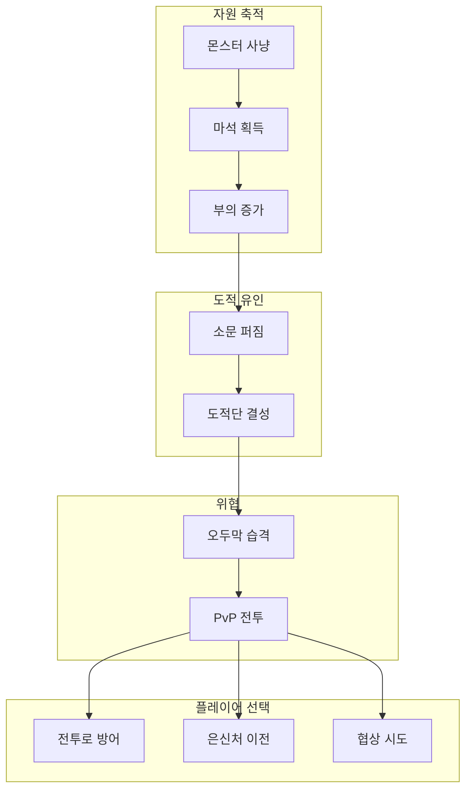
```mermaid
flowchart TB
    subgraph ACCUMULATION["자원 축적"]
        HUNT["몬스터 사냥"] --> MAGIC_STONES["마석 획득"]
        MAGIC_STONES --> WEALTH["부의 증가"]
    end
    
    subgraph ATTRACTION2["도적 유인"]
        WEALTH --> RUMOR["소문 퍼짐"]
        RUMOR --> BANDITS["도적단 결성"]
    end
    
    subgraph THREAT["위협"]
        BANDITS --> RAID["오두막 습격"]
        RAID --> PVP["PvP 전투"]
    end
    
    subgraph CHOICE["플레이어 선택"]
        PVP --> FIGHT["전투로 방어"]
        PVP --> HIDE["은신처 이전"]
        PVP --> NEGOTIATE["협상 시도"]
    end
```

### 3.4 보스 레이드의 서사적 중요성

**보스 등장 조건의 서사화**:
- 딸의 레벨이 특정 임계점에 도달
- 마왕력이 강력한 존재를 끌어들임
- 각 보스는 "딸의 정체성에 대한 단서"를 가짐

**보스 패턴의 서사적 의미**:
| 보스 | 서사적 의미 | 메커닉적 특징 |
|-----|----------|------------|
| 대왕 슬라임 | 딸의 마왕력에 반응한 마물 | 방어구 파괴 패턴 |
|墮落 성녀의 환영 | 딸의 전생과 연결된 존재 | 정신 공격 패턴 |
| 왕국 정찰대 | 딸의 존재를 알아챈 왕국 | PvE+PVP 하이브리드 |

---

## Part 4: 환경 서사 시스템 (Environmental Storytelling)

### 4.1 오두막: 감정적 중심지

오두막은 단순한 건축물이 아닌 **서사의 물리적 표현**입니다.

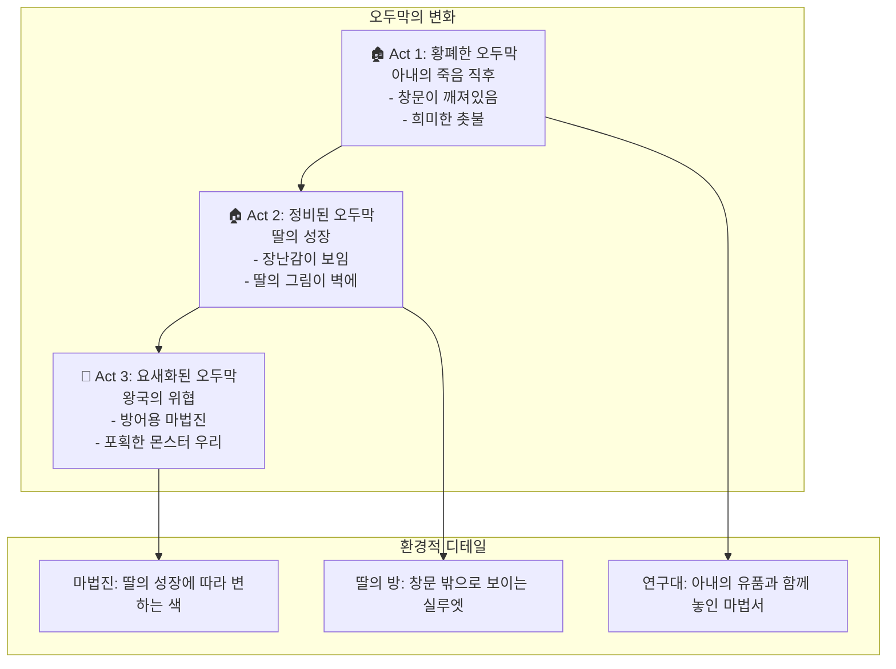
```mermaid
flowchart TB
    subgraph CABIN_EVOLUTION["오두막의 변화"]
        direction TB
        
        C1["🏚️ Act 1: 황폐한 오두막<br/>아내의 죽음 직후<br/>- 창문이 깨져있음<br/>- 희미한 촛불"]
        
        C2["🏠 Act 2: 정비된 오두막<br/>딸의 성장<br/>- 장난감이 보임<br/>- 딸의 그림이 벽에"]
        
        C3["🏰 Act 3: 요새화된 오두막<br/>왕국의 위협<br/>- 방어용 마법진<br/>- 포획한 몬스터 우리"]
    end
    
    subgraph ENVIRONMENTAL_DETAILS["환경적 디테일"]
        D1["딸의 방: 창문 밖으로 보이는 실루엣"]
        D2["연구대: 아내의 유품과 함께 놓인 마법서"]
        D3["마법진: 딸의 성장에 따라 변하는 색"]
    end
    
    C1 --> C2 --> C3
    C2 --> D1
    C1 --> D2
    C3 --> D3
```

### 4.2 명시적 설명 없는 부성애 강화

**"보여주기, 말하지 말기" 원칙**:

| 시각적 요소 | 암시하는 감정 | 구현 방식 |
|-----------|------------|----------|
| 아버지의 휴식 애니메이션 | 딸을 바라보는 시선 | 딸 방향으로 자동 회전 |
| 인벤토리 아이템 | 아내에 대한 그리움 | 아내의 반지 (장식품, 효과 없음) |
| 스킬 이펙트 | 보호의 의지 | 방패 스킬에 딸의 실루엣 |
| 사망 시 | 딸에 대한 걱정 | "딸을... 지켜..." 라는 메시지 |

### 4.3 몬스터의 서사적 변화

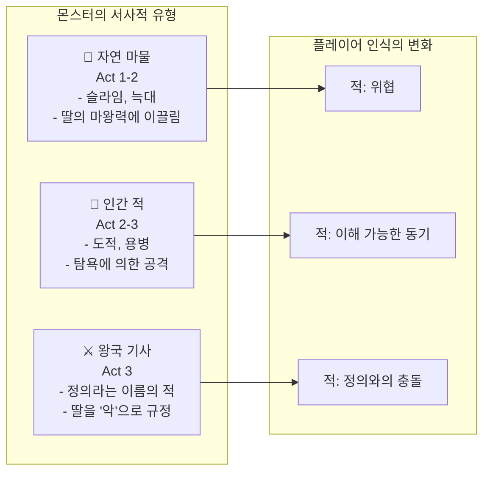
```mermaid
flowchart LR
    subgraph MONSTER_TYPES["몬스터의 서사적 유형"]
        M1["🐾 자연 마물<br/>Act 1-2<br/>- 슬라임, 늑대<br/>- 딸의 마왕력에 이끌림"]
        
        M2["👤 인간 적<br/>Act 2-3<br/>- 도적, 용병<br/>- 탐욕에 의한 공격"]
        
        M3["⚔️ 왕국 기사<br/>Act 3<br/>- 정의라는 이름의 적<br/>- 딸을 '악'으로 규정"]
    end
    
    subgraph EVOLUTION["플레이어 인식의 변화"]
        E1["적: 위협"]
        E2["적: 이해 가능한 동기"]
        E3["적: 정의와의 충돌"]
    end
    
    M1 --> E1
    M2 --> E2
    M3 --> E3
```

---

## Part 5: 난이도 곡선과 서사적 에스컬레이션

### 5.1 동기화된 난이도-서사 곡선

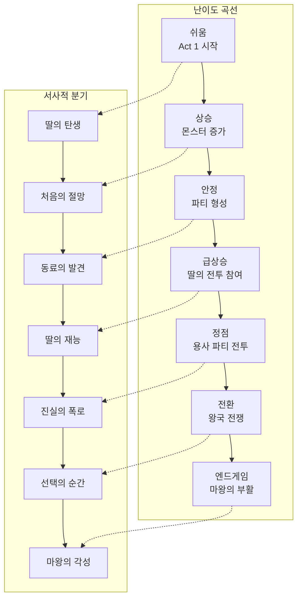
```mermaid
flowchart TB
    subgraph DIFFICULTY_CURVE["난이도 곡선"]
        direction TB
        
        D_START["쉬움<br/>Act 1 시작"]
        D_RISE1["상승<br/>몬스터 증가"]
        D_PLATEAU1["안정<br/>파티 형성"]
        D_RISE2["급상승<br/>딸의 전투 참여"]
        D_PEAK["정점<br/>용사 파티 전투"]
        D_TRANSITION["전환<br/>왕국 전쟁"]
        D_END["엔드게임<br/>마왕의 부활"]
        
        D_START --> D_RISE1 --> D_PLATEAU1 --> D_RISE2 --> D_PEAK --> D_TRANSITION --> D_END
    end
    
    subgraph NARRATIVE_BEATS["서사적 분기"]
        N1["딸의 탄생"]
        N2["처음의 절망"]
        N3["동료의 발견"]
        N4["딸의 재능"]
        N5["진실의 폭로"]
        N6["선택의 순간"]
        N7["마왕의 각성"]
        
        N1 --> N2 --> N3 --> N4 --> N5 --> N6 --> N7
    end
    
    D_START -.-> N1
    D_RISE1 -.-> N2
    D_PLATEAU1 -.-> N3
    D_RISE2 -.-> N4
    D_PEAK -.-> N5
    D_TRANSITION -.-> N6
    D_END -.-> N7
```

### 5.2 서사적 난이도 조절자

**딸의 상태에 따른 동적 난이도**:

| 딸의 상태 | 게임플레이 영향 | 서사적 의미 |
|----------|--------------|------------|
| **안정** | 정상 난이도 | 평화로운 일상 |
| **불안** | 몬스터 증가 | 딸의 감정이 마왕력에 영향 |
| **위험** | 보스 등장 | 딸의 생명이 위협받음 |
| **각성** | 플레이어 버프 | 딸의 힘이 폭발 |

### 5.3 학습 곡선의 서사화

```
[스킬 해금의 서사적 순서]

1. 기본 마법 (Act 1)
   └─ 서사: "아내가 가르쳐준 마법"
   └─ 메커닉: 단순 공격 마법

2. 방어 마법 (Act 1 후반)
   └─ 서사: "딸을 지키기 위해 개발"
   └─ 메커닉: 실드, 힐

3. 파티 버프 (Act 2)
   └─ 서사: "동료를 위한 마법"
   └─ 메커닉: 아군 강화

4. 딸과의 콤보 (Act 2 후반)
   └─ 서사: "딸과의 호흡"
   └─ 메커닉: 딸과 함께 쓰는 강력한 마법

5. 마왕력 활용 (Act 3)
   └─ 서사: "딸의 힘을 빌림"
   └─ 메커닉: 압도적인 파괴 마법
```

---

## Part 6: 멀티플레이어 인프라와 감정적 친밀감 보존

### 6.1 싱글플레이어 감정선의 보존

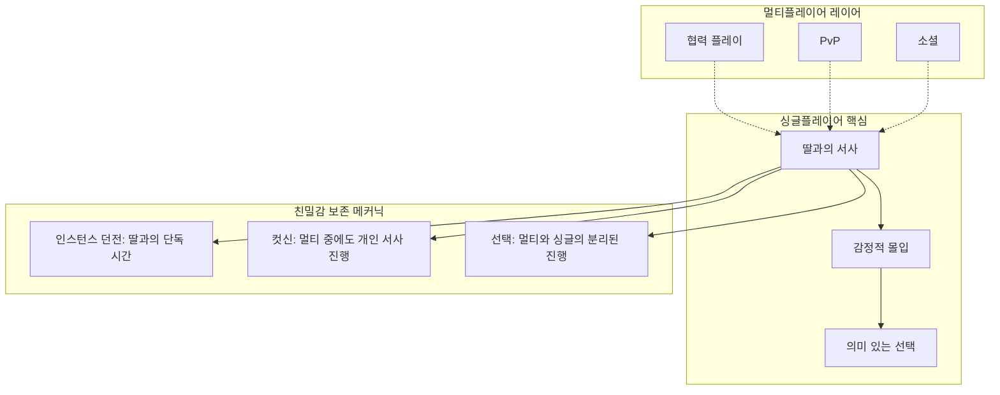
```mermaid
flowchart TB
    subgraph SINGLE_PLAYER_CORE["싱글플레이어 핵심"]
        STORY["딸과의 서사"] --> EMOTION["감정적 몰입"]
        EMOTION --> CHOICE["의미 있는 선택"]
    end
    
    subgraph MULTIPLAYER_LAYER["멀티플레이어 레이어"]
        COOP["협력 플레이"] -.-> STORY
        PVP["PvP"] -.-> STORY
        SOCIAL["소셜"] -.-> STORY
    end
    
    subgraph PRESERVATION["친밀감 보존 메커닉"]
        P1["인스턴스 던전: 딸과의 단독 시간"]
        P2["컷신: 멀티 중에도 개인 서사 진행"]
        P3["선택: 멀티와 싱글의 분리된 진행"]
    end
    
    STORY --> P1
    STORY --> P2
    STORY --> P3
```

### 6.2 멀티플레이어 서사 통합: "아버지들의 연대"

**핵심 질문의 해답**: 모든 플레이어가 각자 딸을 가진 아버지라면, 서로를 어떻게 바라보는가?

#### 6.2.1 동질감의 발견: "우리는 같은 길을 걷는다"

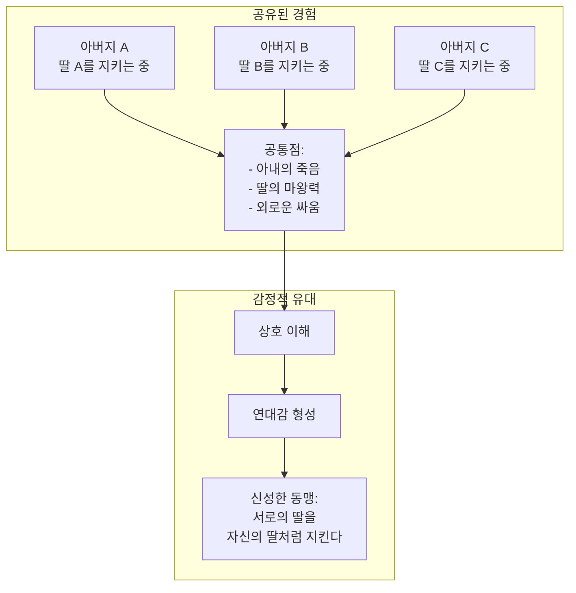
```mermaid
flowchart TB
    subgraph SHARED_EXPERIENCE["공유된 경험"]
        F1["아버지 A<br/>딸 A를 지키는 중"] --> COMMON["공통점:<br/>- 아내의 죽음<br/>- 딸의 마왕력<br/>- 외로운 싸움"]
        F2["아버지 B<br/>딸 B를 지키는 중"] --> COMMON
        F3["아버지 C<br/>딸 C를 지키는 중"] --> COMMON
    end
    
    subgraph EMOTIONAL_BOND["감정적 유대"]
        COMMON --> UNDERSTANDING["상호 이해"]
        UNDERSTANDING --> ALLIANCE["연대감 형성"]
        ALLIANCE --> SACRED_PACT["신성한 동맹:<br/>서로의 딸을<br/>자신의 딸처럼 지킨다"]
    end
```

**서사적 포지셔닝**:
> "당신도 딸을 지키는 아버지입니다.
> 우리는 혼자가 아닙니다.
> 서로의 딸을 지켜주는 동료입니다."

#### 6.2.2 파티 플레이의 서사적 재정의

**기존 파티 개념의 변화**:
| 기존 MMORPG | Yurika Online의 재정의 |
|------------|----------------------|
| "파티원" | "딸들의 아버지 연합" |
| "파티 초대" | "도움을 요청하는 아버지" |
| "파티 해산" | "각자의 오두막으로 돌아가는 아버지들" |
| "파티 경험치 공유" | "함께 지킨 딸들의 성장" |

**파티 구성 시 서사적 순간**:
```
[파티 형성 시나리오]

아버지 A: "내 딸이 위험해... 혼자서는 막을 수 없어"
아버지 B: "나도 마찬가야. 내 딸도 지금 몬스터들에게 둘러싸여있어"
아버지 A: "함께 하자. 네 딸은 내가 지키겠다"
아버지 B: "그리고 내가 네 딸을 지키겠다"

[시스템 메시지]: "두 아버지의 신성한 동맹이 형성되었습니다"
```

#### 6.2.3 딸들의 상호작용: "딸들의 우정"

**파티 시 딸들의 반응**:
| 상황 | 딸 A의 반응 | 딸 B의 반응 |
|-----|-----------|-----------|
| 파티 형성 | "아빠, 저 아저씨도 딸이 있대?" | "우와, 친구 생겼다!" |
| 전투 중 | "아빠, 걱정 마!" | "우리 아빠들 최고야!" |
| 위험 상황 | "저 아가씨를 지켜줘야 해!" | "나도 힘낼게!" |
| 파티 해산 | "또 보자!" | "안녕! 다음에 놀자!" |

**특별 이벤트: 딸들의 만남**:
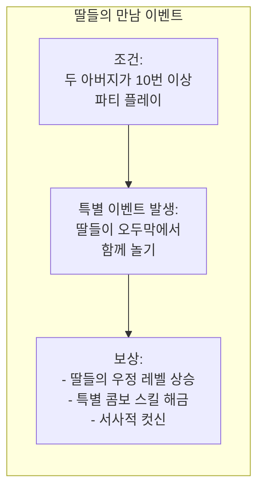
```mermaid
flowchart LR
    subgraph DAUGHTER_MEETING["딸들의 만남 이벤트"]
        TRIGGER["조건:<br/>두 아버지가 10번 이상<br/>파티 플레이"]
        
        EVENT["특별 이벤트 발생:<br/>딸들이 오두막에서<br/>함께 놀기"]
        
        REWARD["보상:<br/>- 딸들의 우정 레벨 상승<br/>- 특별 콤보 스킬 해금<br/>- 서사적 컷신"]
    end
    
    TRIGGER --> EVENT --> REWARD
```

#### 6.2.4 PvP의 서사적 재정의: "아버지들의 비극"

**PvP의 새로운 의미**:
> "도적단의 습격입니다.
> 하지만 이 도적단의 배후에는...
> 다른 아버지가 있을 수도 있습니다."

**PvP 상황에서의 감정적 긴장**:
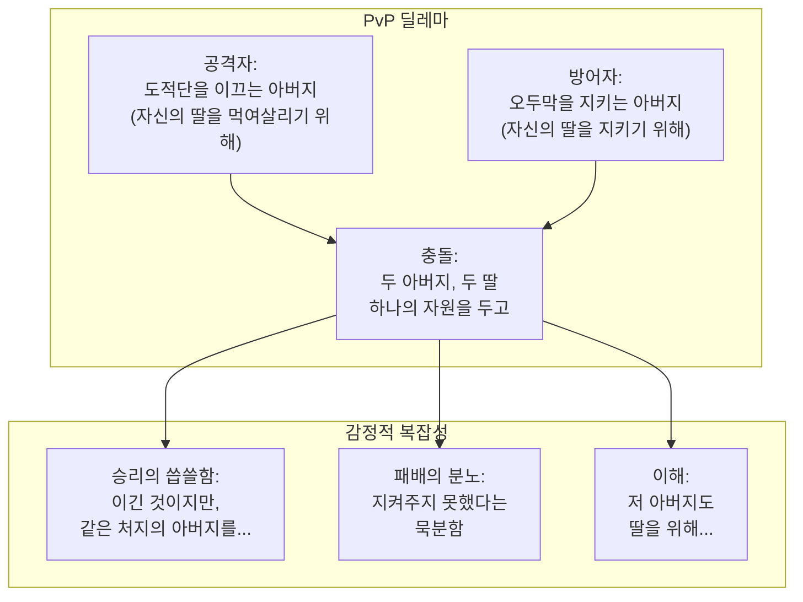
```mermaid
flowchart TB
    subgraph PVP_DILEMMA["PvP 딜레마"]
        ATTACKER["공격자:<br/>도적단을 이끄는 아버지<br/>(자신의 딸을 먹여살리기 위해)"]
        
        DEFENDER["방어자:<br/>오두막을 지키는 아버지<br/>(자신의 딸을 지키기 위해)"]
        
        CONFLICT["충돌:<br/>두 아버지, 두 딸<br/>하나의 자원을 두고"]
    end
    
    subgraph EMOTIONAL_COMPLEXITY["감정적 복잡성"]
        E1["승리의 씁쓸함:<br/>이긴 것이지만,<br/>같은 처지의 아버지를..."]
        E2["패배의 분노:<br/>지켜주지 못했다는<br/>묵분함"]
        E3["이해:<br/>저 아버지도<br/>딸을 위해..."]
    end
    
    ATTACKER --> CONFLICT
    DEFENDER --> CONFLICT
    CONFLICT --> E1
    CONFLICT --> E2
    CONFLICT --> E3
```

**PvP 후의 서사적 선택**:
- **복수**: "내 딸을 위협한 자는 용서하지 않는다"
- **이해**: "저 아버지도 딸을 지키려 했을 뿐"
- **경계**: "다음엔 내가 먼저 공격할 것이다"

#### 6.2.5 서로의 딸을 지키는 메커닉

**"딸 교환 보호" 시스템**:
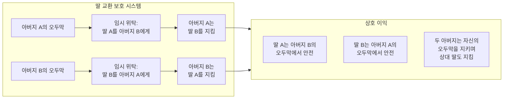
```mermaid
flowchart LR
    subgraph DAUGHTER_EXCHANGE["딸 교환 보호 시스템"]
        FATHER_A["아버지 A의 오두막"] --> EXCHANGE["임시 위탁:<br/>딸 A를 아버지 B에게"]
        FATHER_B["아버지 B의 오두막"] --> EXCHANGE2["임시 위탁:<br/>딸 B를 아버지 A에게"]
        
        EXCHANGE --> DEFENSE_A["아버지 A는<br/>딸 B를 지킴"]
        EXCHANGE2 --> DEFENSE_B["아버지 B는<br/>딸 A를 지킴"]
    end
    
    subgraph BENEFIT["상호 이익"]
        B1["딸 A는 아버지 B의<br/>오두막에서 안전"]
        B2["딸 B는 아버지 A의<br/>오두막에서 안전"]
        B3["두 아버지는 자신의<br/>오두막을 지키며<br/>상대 딸도 지킴"]
    end
    
    DEFENSE_A --> BENEFIT
    DEFENSE_B --> BENEFIT
```

**게임플레이 적용**:
- 플레이어 A가 오프라인일 때, 파티원 B가 A의 딸을 돌봄
- A가 복귀 시, B가 보호한 만큼 딸의 호감도 상승
- "고마워, 네가 없었으면 내 딸이..."

#### 6.2.6 파티 플레이 시 딸의 표현 (상세)

**파티원(다른 아버지)과의 상호작용**:
| 상황 | 딸의 대사 | 감정적 효과 |
|-----|----------|-----------|
| 파티원 접근 | "아빠, 아저씨 왔어!" | 친근감 |
| 파티원 전투 | "아저씨, 조심하세요!" | 걱정 |
| 파티원 부상 | "아빠, 아저씨 다쳤어요!" | 공감 |
| 파티원 퇴장 | "아저씨, 또 오세요!" | 애착 |

**특별 상호작용: 딸들의 대화**:
```
[두 딸이 만났을 때]

딸 A: "너도 아빠랑 살아?"
딸 B: "응! 아빠가 매일 몬스터랑 싸워줘"
딸 A: "우리 아빠도! 아빠들은 다 똑같나봐"
딸 B: "ㅎㅎ 우리 아빠들 친구하면 좋겠다"
딸 A: "그러게! 다음에 또 놀자!"

[아버지들의 반응]
아버지 A: "(미소) 우리 딸들이 친해졌네"
아버지 B: "그러게... 우리도 친해져야겠다"
```

#### 6.2.7 네트워크 동기화의 서사적 활용 (확장)

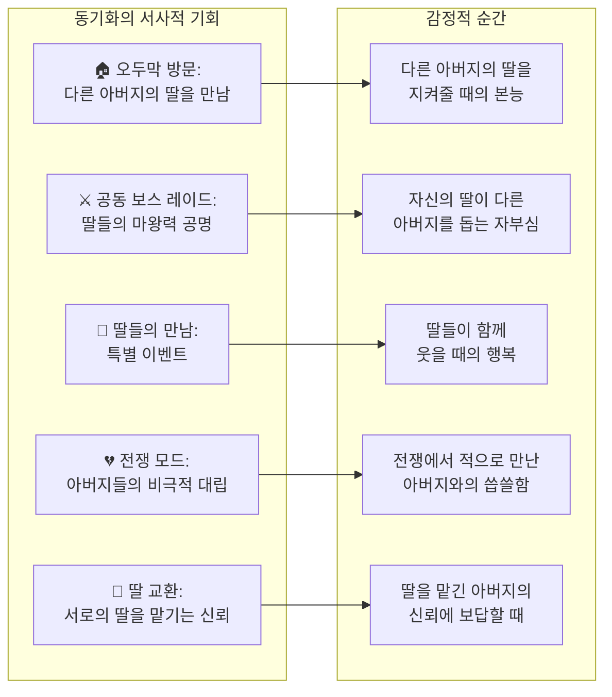
```mermaid
flowchart LR
    subgraph SYNC_OPPORTUNITIES["동기화의 서사적 기회"]
        S1["🏠 오두막 방문:<br/>다른 아버지의 딸을 만남"]
        S2["👧 딸들의 만남:<br/>특별 이벤트"]
        S3["⚔️ 공동 보스 레이드:<br/>딸들의 마왕력 공명"]
        S4["💔 전쟁 모드:<br/>아버지들의 비극적 대립"]
        S5["🤝 딸 교환:<br/>서로의 딸을 맡기는 신뢰"]
    end
    
    subgraph EMOTIONAL_MOMENTS["감정적 순간"]
        E1["다른 아버지의 딸을<br/>지켜줄 때의 본능"]
        E2["자신의 딸이 다른<br/>아버지를 돕는 자부심"]
        E3["딸들이 함께<br/>웃을 때의 행복"]
        E4["전쟁에서 적으로 만난<br/>아버지와의 씁쓸함"]
        E5["딸을 맡긴 아버지의<br/>신뢰에 보답할 때"]
    end
    
    S1 --> E1
    S2 --> E3
    S3 --> E2
    S4 --> E4
    S5 --> E5
```

**서사적 메시지의 일관성**:
> "당신은 혼자가 아닙니다.
> 이 세상에는 당신과 같은 아버지들이 있습니다.
> 딸을 지키기 위해 싸우는,
> 같은 아픔과 같은 사랑을 가진 아버지들이."

### 6.3 네트워크 동기화의 서사적 활용

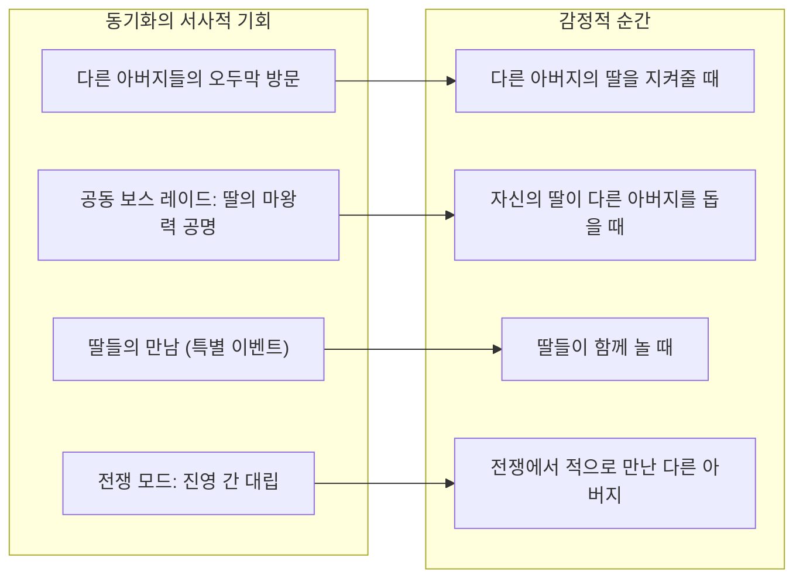
```mermaid
flowchart LR
    subgraph SYNC_OPPORTUNITIES["동기화의 서사적 기회"]
        S1["다른 아버지들의 오두막 방문"]
        S2["딸들의 만남 (특별 이벤트)"]
        S3["공동 보스 레이드: 딸의 마왕력 공명"]
        S4["전쟁 모드: 진영 간 대립"]
    end
    
    subgraph EMOTIONAL_MOMENTS["감정적 순간"]
        E1["다른 아버지의 딸을 지켜줄 때"]
        E2["자신의 딸이 다른 아버지를 돕을 때"]
        E3["딸들이 함께 놀 때"]
        E4["전쟁에서 적으로 만난 다른 아버지"]
    end
    
    S1 --> E1
    S2 --> E3
    S3 --> E2
    S4 --> E4
```

---

## Part 7: 엔드게임 디자인과 서사적 결론

### 7.1 엔드게임의 서사적 정당성

**전통적 MMORPG의 문제**:
- 스토리 종료 후 "왜 계속 하는가?"
- 서사와 분리된 기계적 반복

**서사적 해결**:
> "왕국을 물리쳤지만, 세상은 여전히 딸을 위협합니다. 
> 아버지로서, 마왕의 수호자로서, 
> 당신의 여정은 계속됩니다."

### 7.2 3가지 엔드게임 루프

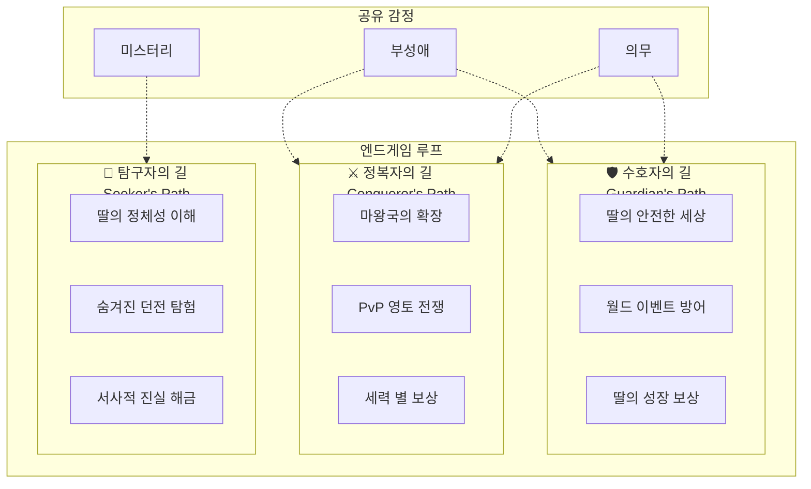
```mermaid
flowchart TB
    subgraph ENDGAME_LOOPS["엔드게임 루프"]
        direction TB
        
        subgraph LOOP1["🛡️ 수호자의 길<br/>Guardian's Path"]
            L1_GOAL["딸의 안전한 세상"]
            L1_ACT["월드 이벤트 방어"]
            L1_RWD["딸의 성장 보상"]
        end
        
        subgraph LOOP2["⚔️ 정복자의 길<br/>Conqueror's Path"]
            L2_GOAL["마왕국의 확장"]
            L2_ACT["PvP 영토 전쟁"]
            L2_RWD["세력 별 보상"]
        end
        
        subgraph LOOP3["📜 탐구자의 길<br/>Seeker's Path"]
            L3_GOAL["딸의 정체성 이해"]
            L3_ACT["숨겨진 던전 탐험"]
            L3_RWD["서사적 진실 해금"]
        end
    end
    
    subgraph SHARED_EMOTION["공유 감정"]
        LOVE["부성애"]
        MYSTERY["미스터리"]
        DUTY["의무"]
    end
    
    LOVE -.-> LOOP1
    LOVE -.-> LOOP2
    MYSTERY -.-> LOOP3
    DUTY -.-> LOOP1
    DUTY -.-> LOOP2
```

### 7.3 딸의 성장 시스템 (엔드게임)

**딸은 NPC가 아닌 "성장하는 존재"**:

| 엔드게임 단계 | 딸의 상태 | 플레이어 상호작용 |
|------------|----------|----------------|
| **1단계** | 어린 아이 | 보호, 가르침 |
| **2단계** | 마법 학徒 | 협력, 조언 |
| **3단계** | 독립적 마법사 | 동등한 파트너 |
| **4단계** | 마왕의 계승자 | 힘의 근원 |

### 7.4 서사적 결말의 다양성

**플레이어의 선택에 따른 엔딩**:

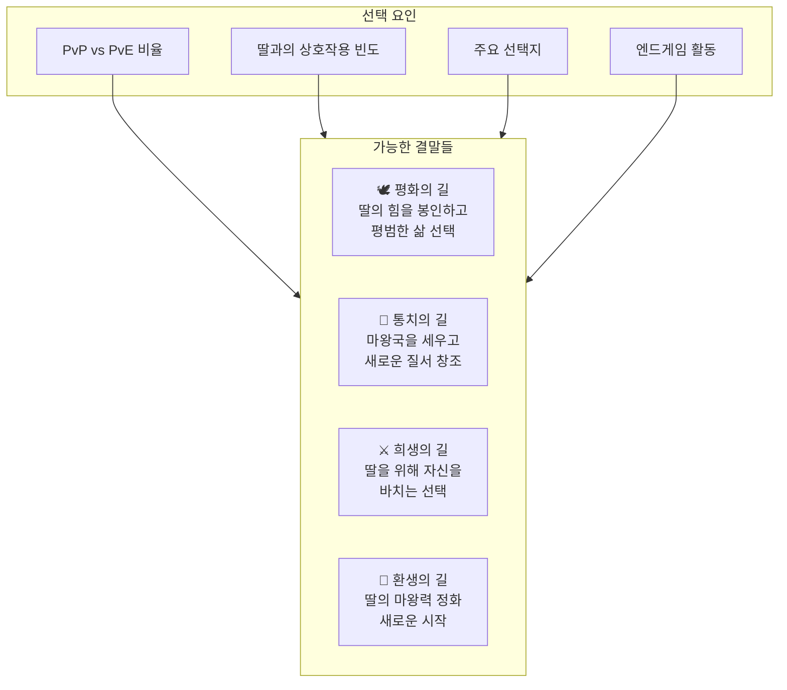
```mermaid
flowchart TB
    subgraph ENDINGS["가능한 결말들"]
        E_PEACE["🕊️ 평화의 길<br/>딸의 힘을 봉인하고<br/>평범한 삶 선택"]
        
        E_RULE["👑 통치의 길<br/>마왕국을 세우고<br/>새로운 질서 창조"]
        
        E_SACRIFICE["⚔️ 희생의 길<br/>딸을 위해 자신을<br/>바치는 선택"]
        
        E_REBIRTH["🌅 환생의 길<br/>딸의 마왕력 정화<br/>새로운 시작"]
    end
    
    subgraph CHOICE_FACTORS["선택 요인"]
        C1["PvP vs PvE 비율"]
        C2["딸과의 상호작용 빈도"]
        C3["주요 선택지"]
        C4["엔드게임 활동"]
    end
    
    C1 --> ENDINGS
    C2 --> ENDINGS
    C3 --> ENDINGS
    C4 --> ENDINGS
```

---

## Part 8: 윤리적 수익화 모델

### 8.1 부성적 관계의 신성함 존중

**금지 요소**:
- 딸을 "상품"으로 만드는 요소
- 딸의 성장을 "지불"로 가속화
- 딸과의 유대를 "구매"로 대체

**허용 요소**:
- 아버지(플레이어)의 외형 커스터마이징
- 오두막 장식 아이템
- 서사적 스킨 (아버지의 과거 의상 등)

### 8.2 윤리적 수익화 구조

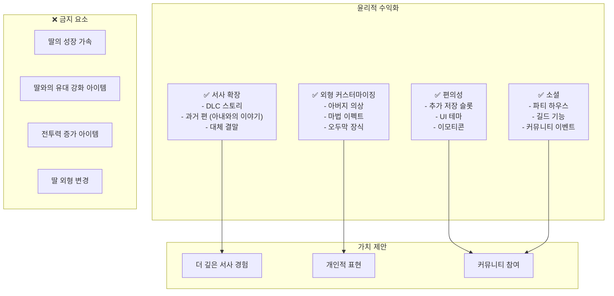
```mermaid
flowchart TB
    subgraph ETHICAL_MONETIZATION["윤리적 수익화"]
        direction TB
        
        COSMETIC["✅ 외형 커스터마이징<br/>- 아버지 의상<br/>- 마법 이펙트<br/>- 오두막 장식"]
        
        CONVENIENCE["✅ 편의성<br/>- 추가 저장 슬롯<br/>- UI 테마<br/>- 이모티콘"]
        
        STORY["✅ 서사 확장<br/>- DLC 스토리<br/>- 과거 편 (아내와의 이야기)<br/>- 대체 결말"]
        
        SOCIAL["✅ 소셜<br/>- 파티 하우스<br/>- 길드 기능<br/>- 커뮤니티 이벤트"]
    end
    
    subgraph FORBIDDEN["❌ 금지 요소"]
        F1["딸의 성장 가속"]
        F2["딸와의 유대 강화 아이템"]
        F3["전투력 증가 아이템"]
        F4["딸 외형 변경"]
    end
    
    subgraph VALUE_PROPOSITION["가치 제안"]
        V1["더 깊은 서사 경험"]
        V2["개인적 표현"]
        V3["커뮤니티 참여"]
    end
    
    COSMETIC --> V2
    CONVENIENCE --> V3
    STORY --> V1
    SOCIAL --> V3
```

### 8.3 서사적 보상의 순수성

**핵심 원칙**: 
> "딸과의 순간은 돈으로 살 수 없습니다."

**구현**:
- 딸의 성장은 시간과 플레이에 의해서만
- 딸과의 특별한 순간은 업적으로만 해금
- 딸의 대사는 서사 진행도에만 의존

---

## Part 9: 구현 로드맵

### 9.1 단계별 개발 우선순위

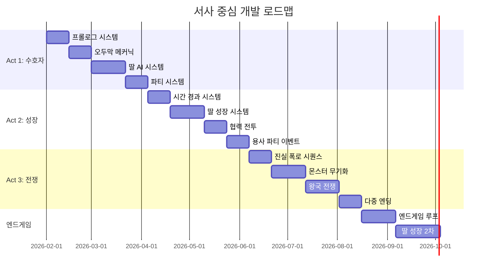
```mermaid
gantt
    title 서사 중심 개발 로드맵
    dateFormat  YYYY-MM-DD
    section Act 1: 수호자
    프롤로그 시스템      :a1, 2026-02-01, 2w
    오두막 메커닉       :a2, after a1, 2w
    딸 AI 시스템        :a3, after a2, 3w
    파티 시스템         :a4, after a3, 2w
    
    section Act 2: 성장
    시간 경과 시스템     :b1, after a4, 2w
    딸 성장 시스템       :b2, after b1, 3w
    협력 전투           :b3, after b2, 2w
    용사 파티 이벤트     :b4, after b3, 2w
    
    section Act 3: 전쟁
    진실 폭로 시퀀스     :c1, after b4, 2w
    몬스터 무기화       :c2, after c1, 3w
    왕국 전쟁           :c3, after c2, 3w
    다중 엔딩           :c4, after c3, 2w
    
    section 엔드게임
    엔드게임 루프       :d1, after c4, 3w
    딸 성장 2차         :d2, after d1, 4w
```

### 9.2 핵심 기술 요구사항

| 시스템 | 기술 요구사항 | 우선순위 |
|-------|------------|---------|
| 딸 AI | 상태 기계 + 감정 시스템 | P0 |
| 오두막 | 인스턴스 공간 + 상호작용 | P0 |
| 시간 경과 | 세이브 데이터 확장 | P1 |
| 서사 분기 | 선택지 저장 시스템 | P1 |
| 다중 엔딩 | 엔딩 조건 체크 | P2 |

### 9.3 성공 지표 (KPI)

**정량적 지표**:
- Day 1 Retention: 40%+
- Day 7 Retention: 15%+
- 평균 세션 길이: 25분+
- Act 2 도달률: 30%+

**정성적 지표**:
- "딸"에 대한 커뮤니티 언급 빈도
- 서사 관련 피드백 비율
- 감정적 연결 설문 결과

---

## 결론: 걸작을 향한 여정

이 설계는 단순한 기능 추가가 아닌 **게임의 영혼을 바꾸는 작업**입니다.

핵심 철학:
> **"Every mechanic tells a story. Every story serves the bond between father and daughter."**
> (모든 메커닉이 이야기를 전하고, 모든 이야기가 부녀의 유대를 위해 존재한다.)

플레이어는 더 이상 "경험치를 위해 사냥하는 마법사"가 아닙니다.
그들은 **"사랑하는 딸을 지키기 위해 싸우는 아버지"**입니다.

이 변화가 바로 Yurika Online을 걸작으로 만드는 열쇠입니다.

---

*문서 버전: 1.0*
*작성일: 2026-02-02*
*작성자: AI Game Designer*
