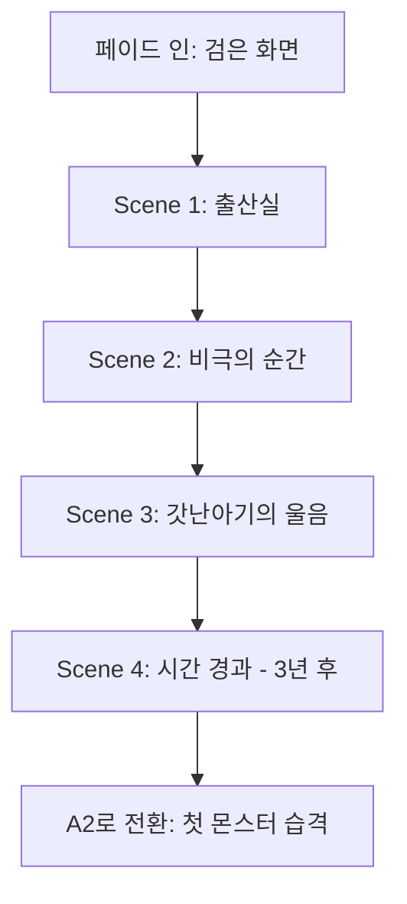
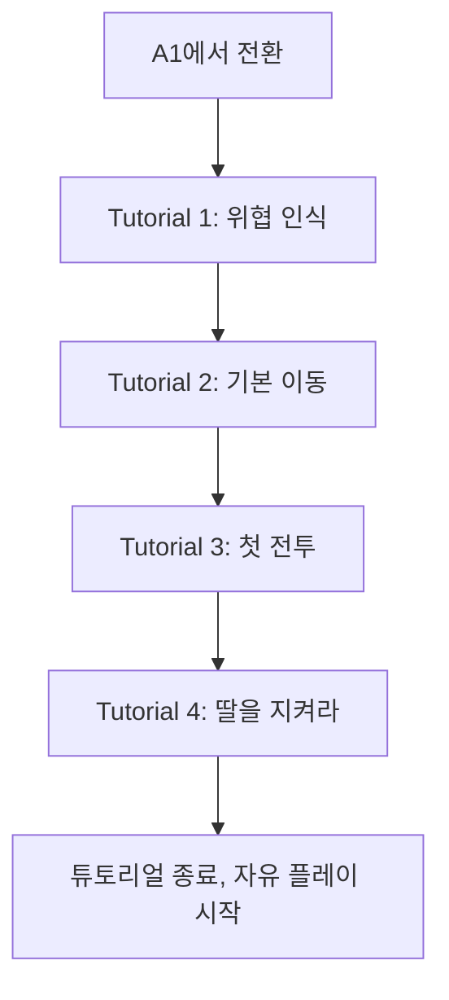

# Chapter 1.1 구현 계획: A1-A2 (프롤로그 → 첫 번째 몬스터 습격)

## Executive Summary

**목표**: 현재의 "허접한" 프롤로그를 시나리오 1을 기반으로 **감정적으로 몰입되는 오프닝 시퀀스**로 전환합니다.

**핵심 감정적 훅**: "아내를 잃었지만, 딸을 지킨다"

---

## Act 1.1-A1: 프롤로그 - 아내의 죽음과 딸의 탄생

### 📖 서사적 목표
- 플레이어에게 **부성애**라는 핵심 감정을 즉시 전달
- 아내의 죽음 → 딸의 탄생이라는 극적 대비를 통해 감정적 투자 유도
- "왜 이곳(오두막)에 있는가"와 "왜 싸워야 하는가"에 대한 명확한 동기 제공

### 🎬 시퀀스 구조



#### Scene 1: 출산실 (0:00 - 0:20)
**시각적 연출**:
- 오두막 내부, 흔들리는 촛불
- 카메라: 천장에서 아래로 천천히 내려오며 침대 위 인물들 보여줌
- 아내(침대에 누움), 주인공(아내의 손을 잡음), 산파(긴장한 표정)

**사운드**:
- 배경: 밤의 빗소리, 천둥소리(먼 거리)
- 아내의 힘든 호흡 소리
- 산파: "조금만 더... 조금만 더 버티세요!"

**기술 요구사항**:
- 새로운 씬: `BirthScene` (인게임 렌더 또는 이벤트 CG)
- 카메라 제어: 줌, 팬 확장
- 오디오: 레이어드 사운드 (빗소리 + 대사 + 음악)

#### Scene 2: 비극의 순간 (0:20 - 0:45)
**시각적 연출**:
- 갓난아기의 첫 울음소리(화면 밖)
- 카메라: 주인공의 얼굴 클로즈업 (안도 → 공포)
- 산파가 주인공을 바라보며 고개를 젓는 모습
- 아내의 손이 주인공의 손에서 천천히 미끄러짐

**대사**:
```
산파: "아기는... 무사합니다. 하지만..."
주인공: (침묵, 손을 떨며) "여보... 여보!"
```

**사운드**:
- 빗소리가 갑자기 강해짐
- 슬픈 피아노 선율 시작
- 아기의 울음소리(계속)

**감정적 효과**:
- 플레이어에게 즉각적인 상실감 전달
- 아기의 울음 = 희망과 책임의 상징

#### Scene 3: 갓난아기와의 첫 대면 (0:45 - 1:15)
**시각적 연출**:
- 페이드: 침대에서 창가로
- 주인공이 창가에 앉아 아기를 안고 있음
- 아기의 얼굴(아직 눈을 뜨지 않음)
- 주인공의 눈에서 눈물이 떨어짐

**대사/내레이션**:
```
주인공: "미안해... 엄마를 지키지 못했어."
주인공: "하지만 너는... 너만은 반드시 지킬게."
```

**카메라 연출**:
- 주인공과 아기를 포함한 미디엄 샷
- 창 밖으로 비가 그치고 새벽빛이 들어옴
- 빛이 아기의 얼굴을 비춤 (희망의 상징)

**UI 인터랙션**:
- 화면 중앙에 메시지: "딸의 이름을 지어주세요"
- 텍스트 입력창 (기본값: "유리")
- 확인 버튼: "이름 짓기"

#### Scene 4: 시간 경과 - 3년 후 (1:15 - 1:45)
**시각적 연출**:
- 몽타주 시퀀스:
  1. 아기가 첫 걸음마
  2. 주인공이 마법서를 읽으며 딸을 바라봄
  3. 딸이 웃으며 뛰어다님
  4. 오두막이 조금씩 정돈되는 모습

**내레이션**:
```
"3년이 흘렀다."
"딸은 건강하게 자라났고, 나는 그 아이를 지키기 위해 마법을 연구했다."
"하지만... 평화는 오래가지 못했다."
```

**사운드**:
- 부드러운 오케스트라에서 점차 불안한 음악으로 전환
- 마지막 장면: 먼 곳에서 으르렁거리는 소리

**전환**:
- 화면 페이드 아웃
- 으르렁 소리가 점점 커짐
- 페이드 인: 오두막 밖, 밤

---

## Act 1.1-A2: 튜토리얼 - 첫 몬스터의 습격

### 📖 서사적 목표
- 플레이어에게 **전투의 필연성**을 이해시킴
- "몬스터 사냥 = 딸 보호"라는 핵심 메커닉 연결
- 기본 조작법과 전투 시스템 튜토리얼

### 🎬 시퀀스 구조



#### Tutorial 1: 위협 인식 (0:00 - 0:30)
**게임플레이**:
- 자동 시네마틱: 주인공이 오두막 창문에서 밖을 바라봄
- 카메라가 밖으로 나가 슬라임 2마리가 오두막으로 다가오는 모습
- UI 메시지: "뭔가 다가오고 있습니다!"

**시각적**:
- 밤, 달빛
- 슬라임의 실루엣이 숲에서 나타남
- 오두막 창문에서 딸의 실루엣이 보임(자동 트리거)

**대사**:
```
주인공: (독백) "이건... 마물이다!"
딸: (화면 밖) "아빠, 무슨 소리야?"
주인공: "괜찮아, 유리야. 방에 있어."
```

**감정적 연결**:
- 플레이어는 "딸이 위험하다"는 것을 즉시 인식
- 전투 동기가 명확해짐

#### Tutorial 2: 기본 이동 (0:30 - 1:00)
**게임플레이**:
- 플레이어 제어권 획득
- UI 가이드: "WASD로 이동하세요"
- 목표 마커: 오두막 문 앞

**시각적**:
- 캐릭터 하이라이트
- 이동 방향 화살표

**서사적 통합**:
- 이동하는 동안 내레이션: "딸을 지키기 위해, 나는 밖으로 나가야 한다."

#### Tutorial 3: 첫 전투 (1:00 - 2:30)
**게임플레이 단계**:

1. **적 조우**:
   - 슬라임 1마리가 플레이어에게 접근
   - UI: "마우스 왼쪽 클릭으로 공격하세요"
   
2. **기본 공격 튜토리얼**:
   - 플레이어가 클릭하면 기본 마법 공격
   - 슬라임 HP 바 표시
   - 슬라임이 반격 (플레이어 데미지 -5)

3. **회피 튜토리얼**:
   - UI: "Shift를 눌러 회피하세요"
   - 슬라임이 돌진 준비 시각 효과
   - 성공 시: "잘했습니다!"

4. **첫 처치**:
   - 슬라임 처치
   - 경험치/골드 획득 연출
   - UI: "마석을 획득했습니다. 이것으로 더 강해질 수 있습니다."

**서사적 통합**:
```
주인공: (처치 후) "이 정도는... 문제없어."
(오두막에서 딸의 목소리)
딸: "아빠, 괜찮아?"
주인공: (미소) "응, 괜찮아!"
```

#### Tutorial 4: 딸을 지켜라 - 첫 번째 위기 (2:30 - 4:00)
**게임플레이**:
- 갑자기 슬라임 3마리가 동시에 등장
- UI: "오두막을 지키세요!"
- 미니 타워 디펜스: 슬라임이 오두막으로 향함

**메커닉**:
- 오두막 HP 바 추가 (100/100)
- 슬라임이 오두막에 닿으면 HP 감소
- 플레이어가 모든 슬라임 처치해야 함

**드라마틱 연출**:
- 슬라임 1마리가 오두막에 닿음
- 오두막 HP: 85/100
- 딸의 비명: "아빠!"
- 주인공: "유리! 조금만 버텨!"

**성공 시**:
- 모든 슬라임 처치
- 주인공이 오두막으로 달려가 딸을 확인
- 딸이 울고 있음
- 주인공이 딸을 안아줌

**스킬 언락**:
- UI: "새로운 스킬을 배웠습니다: 방어 결계"
- 서사적 이유: "딸을 지키기 위해 개발한 방어 마법"

**튜토리얼 종료**:
```
주인공: "이제... 더 자주 나타날 거야."
주인공: "더 강해져야 해. 유리를 지키기 위해."
```

- UI: "자유 플레이가 시작됩니다"
- 퀘스트 추가: "슬라임 5마리 처치" (기존 프롤로그 연결)

---

## 🎨 필요한 이미지 에셋

### 1. 캐릭터 일러스트

#### 1.1 아내 (출산 장면용)
**파일명**: `wife_birth_scene.webp`

**프롬프트**:
```
한국 판타지 게임 스타일의 여성 캐릭터 일러스트. 
침대에 누워있는 모습, 긴 갈색 머리, 창백한 피부, 땀을 흘리는 표정.
부드럽고 따뜻한 조명, 중세 판타지 의상(흰색 잠옷).
고품질 2D 일러스트, 애니메이션 스타일, 감정적이고 섬세한 표현.
배경은 나무로 된 침대와 희미한 촛불.
```

#### 1.2 주인공 (마법사, 젊은 아버지)
**파일명**: `protagonist_young_father.webp`

**프롬프트**:
```
한국 판타지 게임 스타일 남성 마법사 캐릭터.
30대 초반, 검은 머리, 진지한 표정, 마법사 로브 (짙은 파란색).
아기를 안고 있는 포즈, 눈가에 눈물, 온화하지만 슬픈 표정.
고품질 2D 일러스트, JRPG 스타일, 부드러운 음영.
배경: 창가, 새벽 햇살이 비치는 분위기.
```

#### 1.3 갓난아기 (딸)
**파일명**: `baby_daughter.webp`

**프롬프트**:
```
한국 판타지 게임 스타일 갓난아기 캐릭터.
흰색 천에 감싸여 있음, 평화롭게 자고 있는 표정.
아기 특유의 부드러운 피부 표현, 작은 주먹을 쥐고 있음.
고품질 2D 일러스트, 따뜻하고 희망적인 분위기.
배경: 흐릿하게 처리, 아기에 포커스.
```

#### 1.4 딸 (3세)
**파일명**: `daughter_age_3.webp`

**프롬프트**:
```
한국 판타지 게임 스타일 3세 여자아이 캐릭터.
짧은 갈색 머리, 큰 눈, 천진난만한 미소.
간단한 원피스 드레스 (연한 하늘색), 맨발.
SD(Super Deformed) 스타일, 귀엽고 사랑스러운 표현.
고품질 2D 일러스트, 배경 투명.
```

#### 1.5 딸 (창문 실루엣)
**파일명**: `daughter_window_silhouette.webp`

**프롬프트**:
```
어린 여자아이의 실루엣, 창문 안쪽에서 밖을 보고 있는 모습.
역광 효과로 인해 검은 실루엣만 보임, 오두막 창문 프레임.
밤 분위기, 창 밖은 달빛, 창 안은 촛불의 따뜻한 빛.
고품질 2D 일러스트, 감성적이고 신비로운 분위기.
```

### 2. 배경 이미지

#### 2.1 오두막 내부 (출산실)
**파일명**: `cabin_interior_birth_room.webp`

**프롬프트**:
```
중세 판타지 오두막 내부, 출산실 풍경.
나무 침대, 희미한 촛불 여러 개, 의료 도구들 (나무 그릇, 천 등).
어두운 조명, 따뜻한 오렌지 빛, 창문으로 빗소리가 들릴 것 같은 분위기.
고품질 2D 배경 일러스트, 판타지 RPG 스타일.
탑다운 또는 3/4 뷰 앵글.
```

#### 2.2 오두막 내부 (거실, 3년 후)
**파일명**: `cabin_interior_living_room.webp`

**프롬프트**:
```
중세 판타지 오두막 내부, 정돈된 거실.
나무 테이블, 마법서가 쌓인 책장, 작은 장난감들 (블록, 인형).
따뜻한 조명, 벽난로의 불빛, 아늑하고 평화로운 분위기.
창가에 작은 의자와 커튼, 고품질 2D 배경 일러스트.
탑다운 또는 3/4 뷰 앵글.
```

#### 2.3 오두막 외부 (밤, 달빛)
**파일명**: `cabin_exterior_night.webp`

**프롬프트**:
```
숲 속의 작은 오두막, 밤 풍경.
달빛이 오두막과 주변 숲을 비춤, 창문에서 따뜻한 불빛.
나무들이 오두막을 둘러싸고 있음, 약간 음산하지만 아늑한 분위기.
고품질 2D 배경 일러스트, 판타지 RPG 스타일.
사이드 뷰 또는 3/4 뷰 앵글.
```

### 3. UI 요소

#### 3.1 감정적 비네트 (슬픔)
**파일명**: `vignette_sorrow.webp`

**프롬프트**:
```
화면 가장자리에 적용할 비네트 효과, 검은색에서 투명으로 그라데이션.
중앙은 완전 투명, 가장자리로 갈수록 짙은 검은색.
슬픔과 상실의 분위기를 강조하는 효과.
PNG 투명 배경, 고해상도.
```

#### 3.2 희망의 빛 오버레이
**파일명**: `overlay_hope_light.webp`

**프롬프트**:
```
부드러운 황금빛 광선 효과, 창문을 통해 들어오는 새벽 빛.
중앙에서 퍼져나가는 따뜻한 빛, 투명도 조절 가능.
희망과 새로운 시작을 상징하는 시각 효과.
PNG 투명 배경, 고해상도.
```

### 4. 시네마틱 이펙트

#### 4.1 빗방울 애니메이션
**파일명**: `rain_particle.webp`

**프롬프트**:
```
빗방울 파티클 텍스처, 투명 배경.
다양한 크기의 빗방울 (작은 것부터 큰 것까지).
애니메이션 프레임으로 사용 가능한 형태.
고해상도 PNG, 투명 배경.
```

#### 4.2 촛불 애니메이션
**파일명**: `candle_flame_animation.webp`

**프롬프트**:
```
촛불 불꽃 애니메이션 스프라이트 시트.
4-5개 프레임, 부드럽게 흔들리는 불꽃.
따뜻한 오렌지색과 노란색, 투명 배경.
고해상도 PNG, 32x64 픽셀 각 프레임.
```

---

## 🔧 기술 구현 요구사항

### 1. 시스템 확장

#### 1.1 시네마틱 시스템 (`CinematicManager.js`)
```javascript
export default class CinematicManager {
    constructor(game) {
        this.game = game;
        this.activeScene = null;
        this.sceneQueue = [];
        this.isPlaying = false;
        
        // 캐릭터 일러스트 캐시
        this.characters = {};
        
        // 배경 이미지 캐시
        this.backgrounds = {};
    }
    
    async playCinematic(cinematicId) {
        // 시네마틱 JSON 로드
        const cinematic = await this.loadCinematicData(cinematicId);
        this.sceneQueue = cinematic.scenes;
        this.isPlaying = true;
        
        // UI 숨기기
        this.game.ui.hideDuringCinematic();
        
        // 첫 장면 재생
        this.playNextScene();
    }
    
    playNextScene() {
        if (this.sceneQueue.length === 0) {
            this.endCinematic();
            return;
        }
        
        this.activeScene = this.sceneQueue.shift();
        this.executeScene(this.activeScene);
    }
    
    executeScene(scene) {
        // 장면 타입에 따라 실행
        switch (scene.type) {
            case 'dialogue':
                this.showDialogue(scene);
                break;
            case 'montage':
                this.playMontage(scene);
                break;
            case 'choice':
                this.showChoice(scene);
                break;
        }
    }
}
```

#### 1.2 네이밍 시스템 확장
```javascript
// CharacterSelectionScene.js 또는 별도 파일
handleDaughterNaming() {
    // UI 표시
    const namingUI = document.getElementById('daughter-naming');
    namingUI.classList.remove('hidden');
    
    // 기본값
    document.getElementById('daughter-name-input').value = '유리';
    
    // 확인 버튼 이벤트
    document.getElementById('confirm-name').onclick = () => {
        const name = document.getElementById('daughter-name-input').value;
        this.game.daughterName = name;
        
        // Firebase에 저장
        this.saveDaughterName(name);
        
        // 시네마틱 계속
        namingUI.classList.add('hidden');
        this.game.cinematicManager.playNextScene();
    };
}
```

#### 1.3 튜토리얼 단계 관리
```javascript
// TutorialManager.js 확장
startCombatTutorial() {
    this.currentStep = 'combat_1';
    this.tutorialData = {
        'combat_1': {
            instruction: '마우스 왼쪽 클릭으로 공격하세요',
            condition: () => this.game.localPlayer.hasAttacked,
            onComplete: () => this.advanceStep('combat_2')
        },
        'combat_2': {
            instruction: 'Shift를 눌러 회피하세요',
            condition: () => this.game.localPlayer.hasDodged,
            onComplete: () => this.advanceStep('combat_3')
        }
        // ...
    };
}
```

### 2. 데이터 파일 구조

#### 2.1 시네마틱 JSON (`prologue.json` 확장)
```json
{
    "id": "chapter_1_1_a1",
    "title": "프롤로그: 아내의 죽음",
    "scenes": [
        {
            "id": "birth_01",
            "type": "dialogue",
            "background": "cabin_interior_birth_room",
            "characters": [
                {
                    "id": "wife",
                    "image": "wife_birth_scene",
                    "position": "center"
                }
            ],
            "camera": {
                "type": "pan_down",
                "duration": 3000,
                "from": {"y": -200},
                "to": {"y": 0}
            },
            "audio": {
                "bgm": "sad_piano",
                "sfx": ["rain", "thunder_distant"]
            },
            "dialogue": {
                "speaker": "산파",
                "text": "조금만 더... 조금만 더 버티세요!",
                "duration": 3000
            },
            "next": "birth_02"
        }
        // ... 더 많은 장면
    ]
}
```

#### 2.2 딸 데이터 확장 (profile)
```javascript
// Firebase 저장 구조 확장
profile: {
    // 기존 필드들...
    
    // 새 필드
    daughter: {
        name: "유리",           // 플레이어가 지은 이름
        age: 3,                 // 현재 나이 (튜토리얼 시작 시)
        bond: 100,              // 유대감 (0-100)
        lastInteraction: 1234567890  // 마지막 상호작용 타임스탬프
    },
    
    story: {
        chapter: "1.1",
        act: "A2",
        checkpoint: "tutorial_complete"
    }
}
```

---

## 📊 Timeline & 우선순위

### Phase 1: 핵심 시네마틱 (Week 1-2)
- [P0] 시네마틱 시스템 기반 구축
- [P0] A1 Scene 1-3 구현 (아내 죽음 ~ 아기 탄생)
- [P1] 이미지 에셋 제작 (아내, 주인공, 아기)
- [P1] 배경음악 및 효과음 통합

### Phase 2: 튜토리얼 (Week 3)
- [P0] A2 전투 튜토리얼 시스템
- [P0] "딸를 지켜라" 미니 이벤트
- [P1] 딸 네이밍 UI

### Phase 3: 폴리싱 (Week 4)
- [P1] 시각 효과 (빗방울, 촛불, 비네트)
- [P2] 몽타주 시퀀스 (3년 성장)
- [P2] 추가 대사 및 연출 디테일

---

## ✅ 성공 지표

### 감정적 몰입
- 플레이어 피드백: "딸을 지키고 싶다" 언급 비율
- 딸 이름 커스터마이징 비율: 70%+

### 튜토리얼 완료율
- A1-A2 완료율: 80%+
- 튜토리얼 중 이탈률: 15% 이하

### 서사적 이해도
- "왜 싸우는지 이해했다" 설문 응답: 90%+
