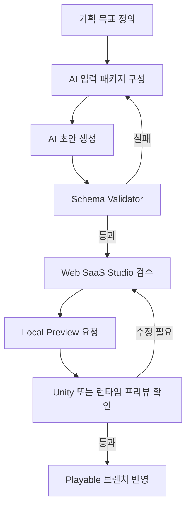

# AI 시나리오 생성 프롬프트 규격서
작성일: 2026-04-09  
상태: Draft / 운영 가능한 초안  
연결 문서:
- [unity_single_mode_studio_playable_architecture_masterplan_2026-04-09.md](./unity_single_mode_studio_playable_architecture_masterplan_2026-04-09.md)
- [content_schema_spec_single_studio_playable_2026-04-09.md](./content_schema_spec_single_studio_playable_2026-04-09.md)
- [card_type_template_json_samples_2026-04-09.md](./card_type_template_json_samples_2026-04-09.md)

## 1. 목적

이 문서는 Studio에서 사용하는 AI 시나리오 생성 흐름의 공통 규격을 정의한다.

목표는 세 가지다.

1. AI가 `part -> card -> field/battle/directing` 구조를 깨지 않고 초안을 만들게 한다.
2. 사람이 검수해야 하는 부분과 AI가 맡아도 되는 부분을 분리한다.
3. 생성 결과가 Web SaaS Studio, Local Workspace Agent, Unity 플레이어블 파이프라인에서 그대로 검증 가능하도록 만든다.

이 문서의 핵심 원칙은 다음과 같다.

- AI는 "완성자"가 아니라 "초안 생성기"다.
- 생성물은 반드시 스키마 친화적이어야 한다.
- 연출 자유도보다 참조 일관성과 수정 가능성이 우선이다.
- 한 번에 거대한 스토리를 쓰기보다 `part`와 `card` 단위로 잘게 나눈다.

## 2. 적용 범위

이 규격은 아래 작업에 적용한다.

- 신규 `part` 구조 초안 생성
- `scen_card` 대사 및 타임라인 초안 생성
- `safe_field_card` 상호작용 초안 생성
- `battle_field_card` 전투 연출 및 웨이브 초안 생성
- 기존 카드 리라이트
- 톤 보정, 길이 축소, 감정선 정렬, 복선 정리

이 규격은 아래 작업에는 직접 사용하지 않는다.

- 최종 Unity 시네머신, 타임라인, 애니메이션 구현
- 실제 아트 제작
- 실제 사운드 편집
- 밸런스 숫자 최종 확정
- 출시 직전 로컬라이징 마감본 확정

## 3. AI 역할 모델

### 3.1 AI가 잘하는 것

- 장면 구조 초안 생성
- 주어진 설정을 기반으로 카드 분해
- 대사 초안 작성
- 선택지와 분기안 제안
- 전투 파트의 웨이브, 연출, 이벤트 순서 초안 작성
- 기존 문체를 흉내 낸 반복 생산
- 긴 시나리오를 카드 단위로 재배열

### 3.2 사람이 반드시 검수해야 하는 것

- 캐릭터 말투 일관성
- 장기 복선과 회수
- 챕터 간 감정선
- 플레이 템포
- 세계관 설정 충돌
- 너무 편한 해결책이나 비의도적 개그화
- 실제 플레이 난이도와 피로도
- 모바일 플레이 체감

### 3.3 운영 원칙

- AI는 새로운 핵심 시스템을 발명하면 안 된다.
- AI는 없는 캐릭터, 없는 지역, 없는 메커니즘을 임의 추가하면 안 된다.
- AI는 참조 가능한 ID만 사용해야 한다.
- AI는 "스토리가 좋아 보이는 것"보다 "나중에 수정 가능한 구조"를 우선해야 한다.

## 4. 입력 계약

AI 요청에는 아래 입력이 가능하면 모두 포함되어야 한다.

### 4.1 필수 입력

- `project_goal`
  - 이번 결과물의 목적
  - 예: "튜토리얼 종료 후 첫 전투 파트 초안"
- `target_scope`
  - `part`, `card`, `dialogue_polish`, `battle_revision` 중 하나 이상
- `target_card_type`
  - `scen_card`, `safe_field_card`, `battle_field_card`, `tutorial_card` 등
- `canonical_ids`
  - 이미 존재하는 `part_id`, `card_id`, `field_id`, `encounter_id`, `character_id`
- `output_mode`
  - `outline`, `hybrid`, `json_only`
- `length_budget`
  - 카드 수, 컷 수, 대사 줄 수, 예상 플레이 시간

### 4.2 강력 권장 입력

- `project_bible`
  - 게임의 정체성, 장르, 분위기, 연출 밀도
- `character_voice_bible`
  - 캐릭터별 말투, 자주 쓰는 표현, 금지 표현
- `current_part_summary`
  - 이전 카드까지의 진행 상황
- `continuity_constraints`
  - 반드시 지켜야 할 설정
- `mechanic_constraints`
  - 이미 구현된 기능 목록
- `asset_constraints`
  - 사용 가능한 배경, 캐릭터, BGM, SFX, 오브젝트
- `rating_constraints`
  - 수위, 폭력성, 표현 제한

### 4.3 선택 입력

- `reference_scene`
  - 분위기 기준이 되는 기존 카드나 텍스트
- `emotional_arc_target`
  - 이번 카드의 정서 곡선
- `mobile_ux_constraints`
  - 텍스트 길이, 튜토리얼 터치 단계 제한
- `monetization_constraints`
  - 상점, 보상, 가챠 등 제한 사항

## 5. 출력 계약

AI 출력은 아래 세 레벨 중 하나를 따른다.

### 5.1 `outline`

사람이 빠르게 구조를 판단할 수 있는 요약형 결과.

- part 목표
- 카드 순서
- 카드별 한 줄 설명
- 분기 포인트
- 감정선 메모

### 5.2 `hybrid`

사람이 읽는 설명과 기계가 읽는 초안 JSON을 같이 포함하는 형태.

- 요약 설명
- 카드별 의도
- JSON 초안
- 검수 체크리스트

### 5.3 `json_only`

Studio와 validator로 바로 흘려보낼 목적의 구조화 출력.

- 오직 JSON만 출력
- 설명 문장 금지
- 모든 참조는 실제 ID 또는 명시적 placeholder 사용
- JSON 스키마에 없는 필드 금지

## 6. 프롬프트 패키지 구조

AI 요청은 되도록 아래 블록으로 구성한다.

```text
[SYSTEM]
역할, 금지사항, 출력 형식, 스키마 규칙

[PROJECT CONTEXT]
프로젝트 정체성, 대상 플랫폼, 톤, 금기

[WORLD & CHARACTER BIBLE]
세계관, 캐릭터 성격, 말투, 관계성

[CURRENT CONTINUITY]
바로 이전 part/card 요약, 반드시 이어져야 하는 정보

[TASK]
이번에 생성할 대상과 범위

[CONSTRAINTS]
기능 제약, 에셋 제약, 길이 제약, 난이도 제약

[OUTPUT CONTRACT]
반드시 따라야 하는 JSON 또는 문서 포맷

[VALIDATION CHECKLIST]
출력 전에 스스로 점검해야 하는 항목
```

## 7. 공통 가드레일

모든 프롬프트는 아래 규칙을 공유한다.

1. 기존 ID를 재사용할 것
2. 새 ID는 규칙에 맞는 snake_case만 사용할 것
3. 없는 기능을 암시하는 문장을 만들지 말 것
4. 캐릭터 음성 톤을 섞지 말 것
5. 한 카드 안에 감정 목표를 1~2개로 제한할 것
6. 튜토리얼 카드에서는 입력 지시를 과하게 겹치지 말 것
7. 전투 카드에서는 실제 플레이 길이를 과장하지 말 것
8. 의미 없는 반복 대사를 줄일 것
9. 다음 카드로 자연스럽게 넘어갈 이유를 남길 것
10. 모바일 읽기 피로를 고려해 대사 길이를 통제할 것

## 8. 카드 타입별 생성 규칙

### 8.1 `scen_card`

중점:

- 감정선
- 장면 전환
- 연출 밀도
- 대사 리듬

규칙:

- 한 카드에서 서사 목적은 1개를 넘지 않는 것이 좋다.
- 컷 수가 늘어나면 `timeline beat`를 먼저 정리한다.
- 텍스트 박스 길이는 모바일 기준 2~3줄 리듬을 유지한다.
- BGM 전환은 장면 감정 변화와 연결한다.

### 8.2 `safe_field_card`

중점:

- 탐색
- 오브젝트 상호작용
- 하우징, 제작, 회복, 준비

규칙:

- 인터랙션 목표를 명확히 한다.
- 필드 입장 직후 해야 할 일과 나중에 해도 될 일을 구분한다.
- NPC와 오브젝트의 역할이 겹치지 않게 설계한다.
- 안전지대 카드에는 과도한 긴장 연출을 넣지 않는다.

### 8.3 `battle_field_card`

중점:

- 적 등장 구조
- 전투 페이싱
- 이벤트 웨이브
- 연출과 난이도 연결

규칙:

- 웨이브 목적을 적는다.
- 전투 중 컷신은 짧고 명확해야 한다.
- 전투 중 튜토리얼 지시가 있으면 입력 방해를 최소화한다.
- 보스는 기믹, 실루엣, 리듬 중 최소 하나가 기억에 남아야 한다.

### 8.4 `tutorial_card`

중점:

- 하나의 학습 목표
- 실패 허용
- 즉시 피드백

규칙:

- 한 카드에서 한 기능만 가르치는 쪽이 안전하다.
- 설명보다 체험을 우선한다.
- 성공 조건과 실패 복귀 동작이 분명해야 한다.

## 9. 표준 프롬프트 템플릿

아래 템플릿은 운영 초안이다.

### 9.1 `part` 구조 초안 생성

```text
너는 Unity 기반 싱글 플레이어블 게임의 내러티브 구조 디자이너다.
반드시 기존 콘텐츠 스키마를 지키고, part/card 단위로 쪼개서 제안한다.
새로운 시스템을 발명하지 말고, 제공된 기능과 설정 안에서만 설계한다.

[PROJECT GOAL]
{project_goal}

[CURRENT CONTINUITY]
{current_part_summary}

[TARGET]
part 초안 생성

[CONSTRAINTS]
- target_part_id: {target_part_id}
- target_play_minutes: {target_play_minutes}
- max_cards: {max_cards}
- allowed_card_types: {allowed_card_types}
- required_beats: {required_beats}
- forbidden_elements: {forbidden_elements}

[OUTPUT]
1. part 요약
2. card 목록
3. card별 목적
4. branch 필요 여부
5. JSON 초안
```

### 9.2 `scen_card` 초안 생성

```text
너는 캐릭터 말투와 감정선 일관성을 중시하는 시나리오 작가다.
출력은 scen_card 초안과 dialogue/timeline 초안을 포함해야 한다.

[CHARACTER VOICE BIBLE]
{character_voice_bible}

[SCENE PURPOSE]
{scene_purpose}

[EMOTIONAL ARC]
{emotional_arc_target}

[CONSTRAINTS]
- card_id: {card_id}
- previous_card_id: {previous_card_id}
- next_card_id: {next_card_id}
- max_dialogue_lines: {max_dialogue_lines}
- bgm_choices: {bgm_choices}
- allowed_characters: {allowed_characters}

[OUTPUT MODE]
json_only
```

### 9.3 `battle_field_card` 초안 생성

```text
너는 전투 흐름 설계자다.
재미보다 먼저 구현 가능성과 가독성을 지켜라.

[BATTLE GOAL]
{battle_goal}

[PLAYER POWER LEVEL]
{player_power_level}

[AVAILABLE MONSTERS]
{available_monsters}

[AVAILABLE SYSTEMS]
{available_systems}

[CONSTRAINTS]
- encounter_id: {encounter_id}
- wave_count_max: {wave_count_max}
- boss_allowed: {boss_allowed}
- tutorial_overlay_allowed: {tutorial_overlay_allowed}
- estimated_duration_sec: {estimated_duration_sec}

[OUTPUT]
- battle_field_card JSON
- encounter JSON
- wave intent notes
```

### 9.4 `safe_field_card` 초안 생성

```text
너는 안전지대 플레이 루프 디자이너다.
휴식, 대화, 하우징, 준비 행동이 자연스럽게 이어지도록 구성하라.

[FIELD PURPOSE]
{field_purpose}

[AVAILABLE OBJECTS]
{available_objects}

[NPCS]
{npcs}

[CONSTRAINTS]
- field_id: {field_id}
- max_primary_interactions: {max_primary_interactions}
- max_optional_interactions: {max_optional_interactions}
- housing_enabled: {housing_enabled}

[OUTPUT]
- safe_field_card JSON
- field interaction draft
- optional interaction list
```

### 9.5 리라이트 / 톤 정리

```text
아래 카드 초안을 유지보수 가능한 구조로 다듬어라.
서사 목적은 유지하되, 말투와 리듬, 길이, 중복만 개선하라.
스키마 필드는 바꾸지 말고 텍스트 값만 수정하라.

[TARGET CARD JSON]
{target_card_json}

[REWRITE GOAL]
{rewrite_goal}

[VOICE BIBLE]
{character_voice_bible}
```

## 10. 기계 모드 출력 규칙

`json_only` 모드에서는 아래를 강제한다.

```text
- 설명 문장 금지
- markdown 금지
- 코드 블록 금지
- 하나의 JSON object 또는 JSON array만 출력
- 모든 필수 필드 포함
- null 사용은 허용된 필드에서만 사용
- 존재하지 않는 참조 금지
```

추가 검증 규칙:

- `card_id`, `field_id`, `encounter_id`는 snake_case
- `type`은 사전 정의된 값만 사용
- 대사 화자는 등록된 `character_id`만 사용
- 타임라인 액션은 허용 액션 집합만 사용

## 11. 사람 검수 체크리스트

### 11.1 구조

- 이 카드가 왜 존재하는지 한 문장으로 설명 가능한가
- 이전 카드와 다음 카드의 연결 이유가 자연스러운가
- 카드가 너무 크거나 너무 작은가

### 11.2 서사

- 캐릭터 말투가 유지되는가
- 감정선이 급격하게 튀지 않는가
- 중요한 정보가 묻히지 않는가

### 11.3 플레이

- 전투 또는 탐색 목적이 분명한가
- 튜토리얼 지시가 과한가
- 모바일에서 읽기 부담이 큰가

### 11.4 데이터

- ID 참조가 실제 존재하는가
- 스키마에 맞지 않는 필드가 없는가
- 추후 수정이 쉬운 구조인가

## 12. 자주 발생하는 실패 패턴

### 12.1 감정 과잉

문제:
대사가 지나치게 장황하고 감정 표현이 과밀함

대응:
카드 목적을 한 줄로 다시 정의하고 대사를 30~50% 축소

### 12.2 세계관 과잉 발명

문제:
AI가 없는 설정을 만들어냄

대응:
`allowed_lore_only: true` 제약 추가

### 12.3 메커니즘 환각

문제:
실제 없는 스킬, UI, 시스템을 전제로 씀

대응:
`available_systems` 목록을 프롬프트에 포함

### 12.4 리듬 붕괴

문제:
대사 카드가 길어져 플레이어가 지침

대응:
`max_dialogue_lines`, `target_minutes`, `beats_per_card` 제약 강화

## 13. 권장 운영 플로우



## 14. 최소 운영 단위

초기 운영에서는 아래 조합만 지원하는 것이 안전하다.

- `part` 초안 생성
- `scen_card` 초안 생성
- `battle_field_card` 초안 생성
- 대사 리라이트

아래는 2차 확장으로 넘긴다.

- 멀티 카드 일괄 재작성
- 로컬라이징 동시 생성
- 자동 분기 최적화
- 하우징 배치 자동 생성

## 15. 운영 권고

1. 먼저 카드 타입을 적게 유지한다.
2. 스타일 가이드를 먼저 확정한다.
3. AI는 한 번에 큰 덩어리보다 작은 카드 묶음을 생성하게 한다.
4. 초안 생성보다 검수 루프 시간을 줄이는 쪽이 더 중요하다.
5. 프롬프트는 프로젝트 공통 템플릿과 카드별 템플릿으로 분리 관리한다.

이 문서는 1차 운영 기준서이며, 실제 Studio 구현 시 프롬프트 카탈로그와 validator 규칙 파일의 상위 명세로 사용한다.
