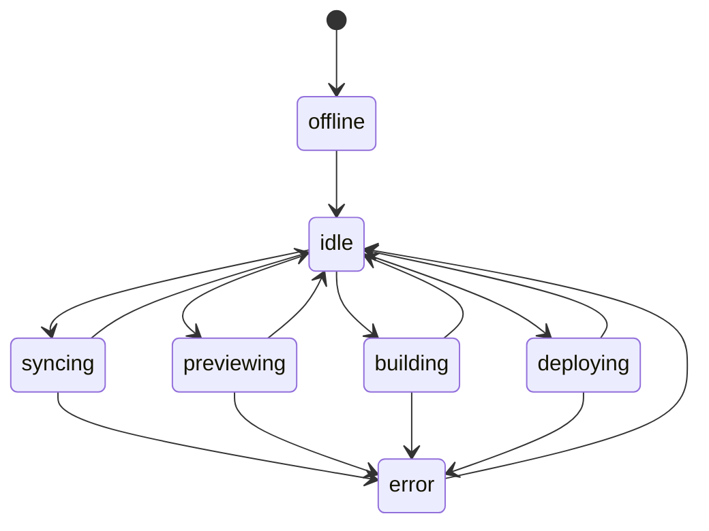

# Local Workspace Agent API 상세 명세
작성일: 2026-04-09  
상태: Draft / 구현 기준 문서  
연결 문서: [unity_single_mode_studio_playable_architecture_masterplan_2026-04-09.md](./unity_single_mode_studio_playable_architecture_masterplan_2026-04-09.md)

## 1. 목적

Local Workspace Agent는 웹 SaaS 편집툴과 로컬 Unity 작업공간 사이를 연결하는 실행 에이전트다.

핵심 역할:

- 로컬 프로젝트 감지
- Git 동기화
- 콘텐츠 변경 반영
- Unity 리프레시
- 프리뷰 실행
- Web/Android/iOS 빌드
- Firebase 배포
- 로그 스트리밍

## 2. 배치 형태

권장 배치:

- 사용자의 PC에서 실행되는 데스크톱 트레이 앱
- 내부적으로 `localhost` 서버 실행
- REST + WebSocket 제공

예시:

- Base URL: `http://127.0.0.1:47831`
- WS URL: `ws://127.0.0.1:47831/ws`

## 3. 보안 원칙

1. 브라우저는 민감한 키를 직접 소유하지 않는다.
2. 에이전트는 화이트리스트된 작업만 수행한다.
3. 모든 위험 작업은 사용자 승인 또는 사전 등록 정책을 따른다.
4. 로컬 파일 접근 범위는 등록된 워크스페이스로 제한한다.
5. 빌드/배포 로그는 사용자 세션 범위 내에서만 노출한다.

## 4. 상태 모델



## 5. 버전 및 호환성

### 에이전트 버전

예:

```json
{
  "agentVersion": "0.1.0",
  "apiVersion": "v1"
}
```

### 호환성 정책

- 웹 SaaS는 최소 지원 에이전트 버전을 가진다.
- 에이전트와 웹이 호환되지 않으면 프리뷰/빌드 버튼을 막고 업그레이드를 요구한다.

## 6. 인증/세션

## 6.1 페어링 흐름

1. 에이전트가 일회용 페어링 코드 생성
2. 사용자가 웹 SaaS에 코드 입력
3. 웹 SaaS가 세션 토큰 발급
4. 이후 요청은 세션 토큰으로 인증

## 6.2 기본 헤더

```http
Authorization: Bearer <local-session-token>
X-Agent-Api-Version: v1
```

## 7. 리소스 모델

주요 리소스:

- `session`
- `workspace`
- `preview`
- `build`
- `deploy`
- `job`
- `logStream`

## 8. 엔드포인트 명세

## 8.1 상태 확인

### `GET /agent/info`

목적:

- 에이전트 버전
- OS
- 연결 상태
- 등록된 워크스페이스 수

응답 예시:

```json
{
  "ok": true,
  "agentVersion": "0.1.0",
  "apiVersion": "v1",
  "platform": "windows",
  "status": "idle",
  "workspaces": 1
}
```

### `GET /agent/health`

목적:

- 생존 여부 확인

## 8.2 세션

### `POST /session/pair/start`

목적:

- 페어링 코드 생성

응답:

```json
{
  "ok": true,
  "pairCode": "A7KD-91QX",
  "expiresInSec": 300
}
```

### `POST /session/pair/complete`

요청:

```json
{
  "pairCode": "A7KD-91QX",
  "sessionToken": "issued-by-saas"
}
```

### `GET /session/status`

목적:

- 현재 연결된 사용자/프로젝트 세션 상태 확인

## 8.3 워크스페이스

### `POST /workspace/detect`

목적:

- Unity 프로젝트 경로 유효성 검사
- Git 저장소 여부 검사

요청:

```json
{
  "path": "C:/dev/yurika_unity"
}
```

응답:

```json
{
  "ok": true,
  "isUnityProject": true,
  "isGitRepo": true,
  "unityVersion": "6000.0.0f1",
  "branch": "single_unity_main"
}
```

### `POST /workspace/register`

목적:

- 에이전트에 로컬 프로젝트 등록

### `GET /workspace/current`

목적:

- 현재 선택된 워크스페이스 확인

### `POST /workspace/select`

목적:

- 등록된 워크스페이스 중 하나 선택

## 8.4 동기화

### `POST /workspace/sync`

목적:

- 브랜치 체크아웃
- fetch/pull
- 변경 적용

요청:

```json
{
  "branch": "feature/part_01_start",
  "mode": "pull_and_apply"
}
```

응답:

```json
{
  "ok": true,
  "jobId": "job_sync_001"
}
```

### `POST /workspace/apply-content-patch`

목적:

- 웹 SaaS에서 온 JSON 변경셋을 로컬 파일에 반영

요청:

```json
{
  "patchSetId": "patch_240409_001",
  "files": [
    {
      "path": "content/cards/scen_01_wakeup.json",
      "content": "{ ... }"
    }
  ]
}
```

## 8.5 Unity 제어

### `POST /unity/refresh`

목적:

- Unity 자산 리프레시 또는 import 강제

### `POST /unity/open`

목적:

- 등록된 프로젝트를 Unity Editor로 열기

### `POST /unity/focus`

목적:

- 실행 중인 Unity 창을 활성화

## 8.6 프리뷰

### `POST /preview/run`

목적:

- 특정 part/card 기준으로 로컬 프리뷰 실행

요청:

```json
{
  "mode": "card",
  "targetId": "scen_01_wakeup",
  "resetSave": true,
  "resetTutorialFlags": true
}
```

응답:

```json
{
  "ok": true,
  "jobId": "job_preview_001",
  "previewUrl": "http://127.0.0.1:47831/preview/card/scen_01_wakeup"
}
```

### `POST /preview/stop`

목적:

- 현재 프리뷰 중지

### `GET /preview/status`

목적:

- 현재 프리뷰 상태 확인

## 8.7 빌드

### `POST /build/web`

목적:

- Web Preview 빌드

요청:

```json
{
  "profile": "preview",
  "branch": "feature/part_01_start"
}
```

### `POST /build/android`

목적:

- Android APK/AAB 빌드

요청:

```json
{
  "profile": "internal_test",
  "buildFormat": "aab",
  "versionName": "0.1.0-alpha",
  "buildNumber": 104
}
```

### `POST /build/ios`

목적:

- iOS 빌드

주의:

- 로컬이 macOS가 아니면 원격 빌드 노드 또는 CI로 위임될 수 있다.

## 8.8 배포

### `POST /deploy/firebase`

목적:

- Studio Portal 또는 Web Preview를 Firebase에 배포

요청:

```json
{
  "target": "web-preview",
  "channelId": "preview-240409-001",
  "artifactPath": "Builds/WebPreview"
}
```

### `POST /deploy/android/internal`

목적:

- Android 내부 테스트 배포

### `POST /deploy/ios/internal`

목적:

- iOS 내부 테스트 배포 또는 메타데이터 패키지 생성

## 8.9 잡과 로그

### `GET /jobs/{jobId}`

목적:

- 잡 상태, 시작 시각, 진행률, 결과물 확인

응답 예시:

```json
{
  "ok": true,
  "job": {
    "id": "job_build_android_004",
    "type": "build.android",
    "status": "running",
    "progress": 62,
    "startedAt": "2026-04-09T03:10:00Z"
  }
}
```

### `GET /jobs/{jobId}/logs`

목적:

- 로그 조회

### `WS /ws`

이벤트 예시:

- `job.started`
- `job.progress`
- `job.completed`
- `job.failed`
- `preview.ready`
- `deploy.completed`

## 9. 에러 모델

표준 응답:

```json
{
  "ok": false,
  "error": {
    "code": "WORKSPACE_NOT_FOUND",
    "message": "No registered Unity workspace"
  }
}
```

주요 에러 코드:

- `UNAUTHORIZED`
- `SESSION_EXPIRED`
- `WORKSPACE_NOT_FOUND`
- `UNSUPPORTED_PROJECT`
- `UNITY_NOT_AVAILABLE`
- `BUILD_FAILED`
- `DEPLOY_FAILED`
- `IOS_BUILD_REQUIRES_MAC`
- `DIRTY_WORKTREE_BLOCKED`

## 10. 안전 정책

### 10.1 허용 명령 제한

허용되는 작업:

- Git fetch/pull/checkout
- 지정된 JSON 파일 쓰기
- Unity 배치모드 실행
- 정해진 빌드 명령
- Firebase 배포 명령

허용하지 않는 작업:

- 임의 shell 명령 실행
- 워크스페이스 바깥 파일 수정
- 브라우저에서 전달한 직접 shell string 실행

### 10.2 더티 워크트리 정책

기본 정책:

- 더티 상태에서 destructive sync 금지
- 변경 충돌이 예상되면 사용자 확인 필요
- 빌드는 가능하지만 배포 전 경고 가능

## 11. 1차안 / 2차안 범위

### 1차안 필수

- `agent/info`
- `session/pair/*`
- `workspace/detect`
- `workspace/register`
- `workspace/sync`
- `preview/run`
- `build/web`
- `deploy/firebase`
- `jobs/*`

### 2차안 확장

- `build/android`
- `build/ios`
- `deploy/android/internal`
- `deploy/ios/internal`
- 고급 로그 스트리밍
- 원격 빌드 노드 연동

## 12. 구현 우선순위

1. 페어링
2. 워크스페이스 등록/검증
3. 동기화
4. 프리뷰
5. Web Preview 빌드/배포
6. Android/iOS 빌드
7. 내부 배포

