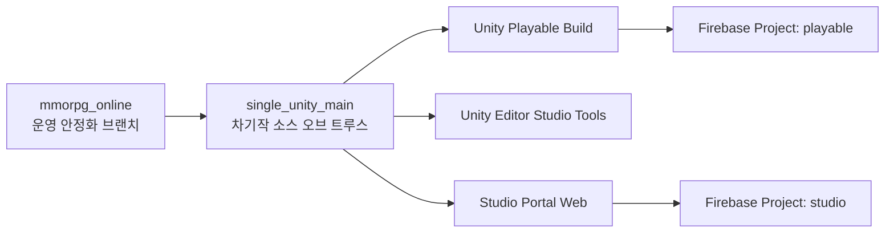
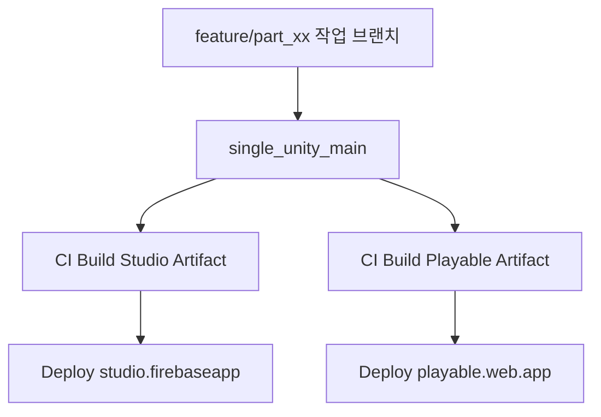
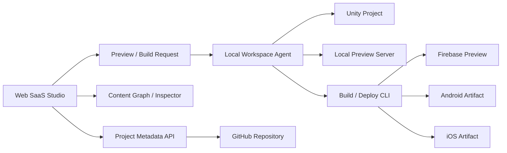
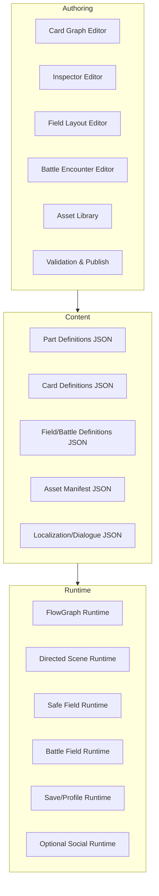
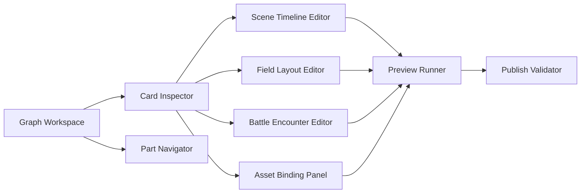
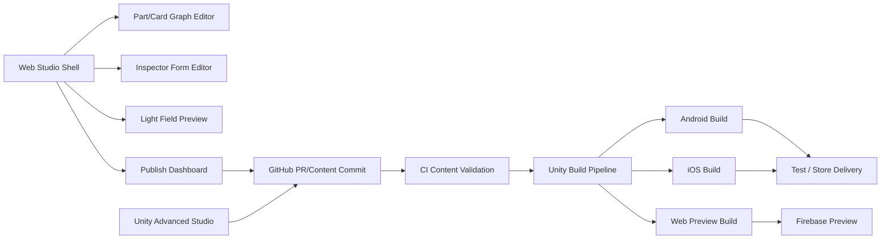
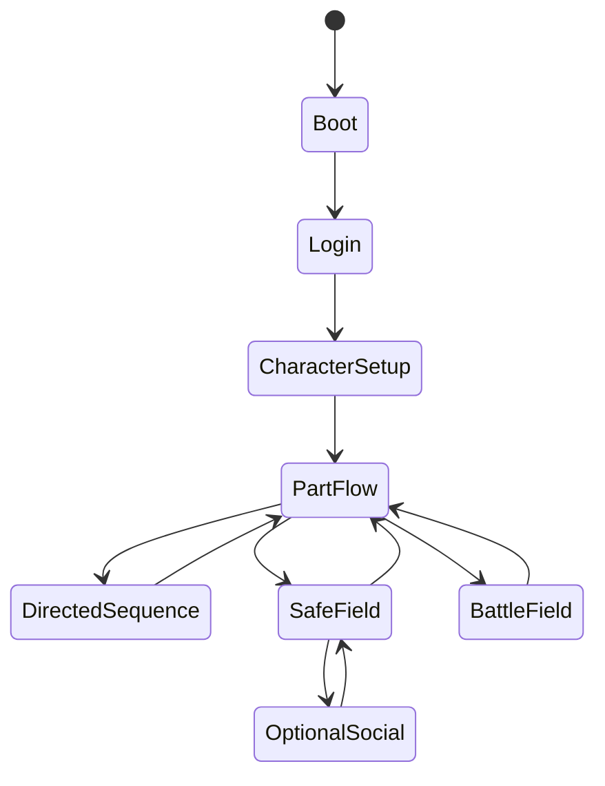
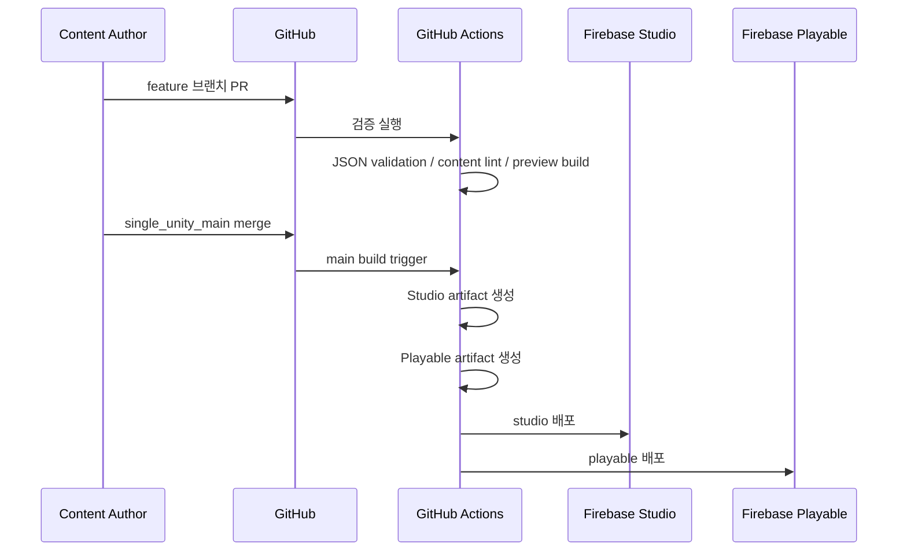
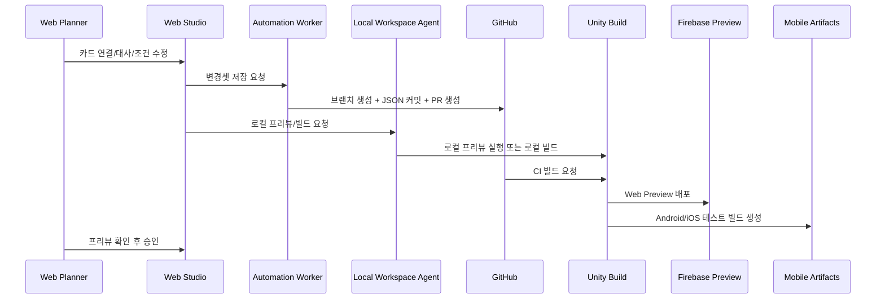

# Unity 기반 싱글모드 전환 및 스튜디오/플레이어블 아키텍처 마스터플랜
작성일: 2026-04-09  
상태: Draft / 실행 가능한 초안  
범위: 현재 `mmorpg_online` 브랜치를 멀티 안정화 완료 후 기준선으로 고정하고, 그 상태를 바탕으로 Unity 기반의 싱글 중심 플레이어블 게임과 게임 제작용 스튜디오를 설계한다.

## 0. 전제와 방향

이 문서는 현재 바닐라 JS + Firebase 기반 프로젝트를 갑자기 전부 뒤엎는 문서가 아니다.  
오히려 다음 세 가지를 동시에 만족시키기 위한 전환 설계다.

1. 현재 `mmorpg_online` 브랜치는 운영 안정화 브랜치로 유지한다.
2. 차기 프로젝트는 싱글 플레이 중심의 콘텐츠 제작과 연출 파이프라인을 우선한다.
3. 멀티플레이는 "필요한 기능만 제한적으로 남기는 옵션"으로 재설계한다.

핵심 결론은 아래와 같다.

- 플레이어블 런타임은 Unity 기반으로 새로 세우는 것이 맞다.
- 콘텐츠 제작 스튜디오는 "카드형 플로우 + 인스펙터 + 현장 편집 + 프리뷰" 중심으로 설계한다.
- 단, 완전한 브라우저 기반 Unity WebGL 스튜디오는 1차 목표로 잡기엔 리스크가 크다.
- 따라서 1차 실전안은 `Unity 플레이어블 + Unity Editor 기반 스튜디오 + Firebase 배포 포털/프리뷰` 구조를 권장한다.
- 사용자가 반드시 웹 스튜디오를 원한다면 2차 확장안으로 별도 설계한다.

관련 상세 문서:

- [content_schema_spec_single_studio_playable_2026-04-09.md](./content_schema_spec_single_studio_playable_2026-04-09.md)
- [local_workspace_agent_api_spec_2026-04-09.md](./local_workspace_agent_api_spec_2026-04-09.md)
- [web_saas_studio_screen_spec_2026-04-09.md](./web_saas_studio_screen_spec_2026-04-09.md)
- [ai_scenario_generation_prompt_spec_2026-04-09.md](./ai_scenario_generation_prompt_spec_2026-04-09.md)
- [card_type_template_json_samples_2026-04-09.md](./card_type_template_json_samples_2026-04-09.md)

---

## 1. 현재 프로젝트 진단

### 1.1 현재 구조의 강점

현재 프로젝트는 이미 "데이터 기반화의 씨앗"을 가지고 있다.

- 씬 전환의 최소 구조가 있다.
  - `login`
  - `charSelect`
  - `world`
- JSON 기반 데이터가 이미 상당수 존재한다.
  - 튜토리얼
  - 퀘스트
  - 몬스터
  - 존
  - 아이템 / 접두사
- 스토리, 튜토리얼, 몬스터, UI, 인벤토리, 퀘스트, 사운드 등 주요 시스템이 이미 분리된 매니저 개념으로 존재한다.
- 모바일/PC 대응 경험이 이미 쌓여 있다.
- Firebase 기반 배포/자동반영 경험이 이미 있다.

즉, "프로토타입을 위한 즉흥 구조"에서 출발했지만, 다음 단계의 콘텐츠 제작 플랫폼으로 옮길 만한 실제 자산은 충분하다.

### 1.2 현재 구조의 병목

하지만 다음 단계로 가기 위해서는 현재 구조를 그대로 확장하면 안 된다.

가장 큰 구조적 병목은 아래 세 가지다.

1. `WorldScene`에 책임이 과도하게 몰려 있다.
2. 멀티플레이 네트워크 경계가 월드 전반에 스며들어 있다.
3. 연출, 스토리, 필드, 전투, UI 편집이 "작가/기획자 친화적 데이터 편집 구조"가 아니라 코드 수정 중심이다.

이 문제는 지금의 운영 브랜치에서는 감수할 수 있지만, 차기 프로젝트에서 콘텐츠 양이 늘어나는 순간 폭발한다.

### 1.3 현재 자산 중 재사용 가치가 높은 부분

아래 자산은 Unity 전환 후에도 재활용 가치가 높다.

- `assets/data/monsters/*.json`
- `assets/data/items/*.json`
- `assets/data/quests/*.json`
- `assets/data/tutorials/*.json`
- `assets/data/zones/*.json`
- 기존 몬스터/아이템/퀘스트 수치 설계
- 현재 실제 플레이에서 검증된 전투 감각
- 모바일 HUD 구성 경험
- 현재 배포/버전/캐시 관리 경험

### 1.4 Unity 전환 시 과감히 버리거나 재구성해야 할 부분

아래는 "재사용"보다 "설계 개념만 가져가고 새로 구현"하는 편이 낫다.

- Canvas 직접 렌더링 루프
- DOM 중심 `UIManager`의 비대화 구조
- `WorldScene` 중심 대형 진입 구조
- Firebase RTDB 중심 실시간 월드 동기화 의존
- 실시간 네트워크 상태를 전제로 한 몬스터/필드 루프

---

## 2. 목표 제품 정의

차기 프로젝트는 사실상 하나의 앱이 아니라 아래 2개 제품으로 보는 것이 맞다.

1. `Playable`
2. `Studio`

### 2.1 Playable 정의

플레이어가 실제로 접속해서 플레이하는 게임 클라이언트다.

목표:

- 싱글 플레이 우선
- 시나리오 기반 진행
- 카드형으로 정의된 씬/필드/전투를 순서대로 재생
- 웹 배포 가능
- 모바일/PC 모두 접근 가능
- 필요 시 일부 멀티 기능만 선택적으로 활성화 가능

### 2.2 Studio 정의

개발자, 기획자, 시나리오 작가, 레벨 디자이너가 콘텐츠를 제작하는 도구다.

목표:

- 카드형 플로우차트 기반 편집
- `part` 단위 분할
- 카드 클릭 시 상세 속성 인스펙터 편집
- 시각 연출, 필드 배치, 몬스터 배치, BGM/SFX, 대사, 튜토리얼, 하우징까지 데이터 기반 편집
- 프리뷰 실행
- 검증 및 배포

---

## 3. 권장 제품/배포 구조

## 3.1 가장 현실적인 권장안

실제로 가장 성공 확률이 높은 안은 아래 구조다.



설명:

- `mmorpg_online`는 유지보수 브랜치로 남긴다.
- 새 소스 기준선은 `single_unity_main` 같은 단일 소스 브랜치로 관리한다.
- 여기서 두 산출물을 만든다.
  - 플레이어블 웹 빌드
  - 스튜디오 포털/프리뷰
- 실질적인 편집툴은 Unity Editor Tooling으로 두고, 배포 포털과 프리뷰만 Firebase에 올린다.

이 방식이 좋은 이유:

- 브라우저에서 무거운 편집기까지 억지로 돌리지 않아도 된다.
- 아트 업로드, 맵 배치, 타임라인 미세 편집, 대량 에셋 참조 작업이 훨씬 안정적이다.
- Unity의 SceneView, Gizmo, Handles, Addressables, Inspector, Timeline과 잘 맞는다.
- 웹은 리뷰/배포/승인/프리뷰에 집중할 수 있다.

## 3.2 사용자가 원한 "Studio 브랜치 / Playable 브랜치"를 어떻게 가져갈지

여기서 중요한 판단이 하나 있다.

### 비권장

아래처럼 두 개를 둘 다 사람 손으로 유지하는 장기 브랜치로 쓰는 방식:

- `studio`
- `playable`

문제:

- 콘텐츠 JSON이 양쪽에서 갈라진다.
- 한 카드 수정이 양쪽 브랜치에 중복 반영된다.
- 충돌과 누락이 누적된다.
- 시간이 갈수록 "어느 브랜치가 진짜 최신인지" 불명확해진다.

### 권장

아래 구조:

- `single_unity_main`: 실제 소스 오브 트루스
- `studio_release`: 자동 배포용 릴리스 브랜치 또는 배포 job
- `playable_release`: 자동 배포용 릴리스 브랜치 또는 배포 job

즉, 편집은 한 군데서 하고 배포만 둘로 나눈다.



이 설계가 가장 중요하다.  
차기작은 "브랜치를 둘로 나누는 것"보다 "콘텐츠 진실의 원천을 하나로 유지하는 것"이 훨씬 중요하다.

## 3.3 새 요구사항을 반영한 판단 기준

이번 추가 요구를 반영하면 의사결정 기준은 아래 4개로 압축된다.

1. 어디서든 편집/수정/배포 작업이 가능해야 한다.
2. 단, 시각화 편집 도구는 반드시 필요하다.
3. 플레이어블은 웹에 묶일 필요가 없고 Android/iOS에서 잘 돌아야 한다.
4. GitHub 기반 협업과 자동 배포 파이프라인은 유지하고 싶다.

이 요구를 기준으로 보면 선택지는 아래처럼 정리된다.

| 안 | 제작 접근성 | 시각화 편집 품질 | 모바일 플레이어블 적합성 | 총평 |
| :--- | :--- | :--- | :--- | :--- |
| 완전 웹 스튜디오 + 웹 플레이어블 | 매우 높음 | 중간 이하 | 중간 | 초기 구현 리스크 큼 |
| Unity Editor 스튜디오 + 웹 플레이어블 | 중간 | 매우 높음 | 중간 | 1차안으로 안전 |
| Unity Editor 스튜디오 + 네이티브 모바일 플레이어블 | 중간 | 매우 높음 | 매우 높음 | 플레이 품질 최상 |
| 하이브리드 웹 스튜디오 + Unity 고급 편집기 + 네이티브 모바일 플레이어블 | 높음 | 매우 높음 | 매우 높음 | 2차안으로 가장 이상적 |

즉, 이번 요구를 반영하면 "플레이어블은 네이티브 모바일 우선", "스튜디오는 웹과 데스크톱 도구를 역할 분담"이 가장 좋은 방향이다.

## 3.4 개선된 권장 결론

따라서 권장 결론을 아래처럼 보강한다.

- 1차안:
  - Unity Editor 기반 스튜디오
  - 웹 Studio Portal은 검수, 그래프 확인, 간단 편집, 프리뷰 실행, 배포 승인에 집중
  - 플레이어블은 Unity 기반으로 Android/iOS 네이티브 빌드를 우선하고, 웹은 선택적 프리뷰 채널로 둔다
- 2차안:
  - 웹 스튜디오에서 part/card 그래프와 경량 필드 편집까지 처리
  - 고급 배치, 타임라인, 복잡한 연출, 아트 정렬은 Unity Editor 고급 도구가 담당
  - 플레이어블은 Android/iOS 중심, 웹은 QA/즉시 확인용 보조 런타임으로 유지

이 보강안의 장점은 아래와 같다.

- 제작자는 노트북/태블릿 브라우저에서도 구조 편집과 승인 작업을 할 수 있다.
- 디자이너는 데스크톱 Unity에서 정밀한 현장 편집을 할 수 있다.
- 최종 플레이 경험은 모바일 네이티브 품질로 가져갈 수 있다.
- 웹은 "편집/검수/프리뷰"에 강점을 살리고, 모바일 앱은 "실제 플레이 품질"에 강점을 살릴 수 있다.

## 3.5 수정 권장안: SaaS 편집툴 + 로컬 워크스페이스 서버

지금 요구를 가장 정확히 만족하는 형태는 아래 구조다.

- 편집툴:
  - SaaS형 웹 브라우저 도구
- 실제 작업 공간:
  - 로컬 PC의 Unity 프로젝트
  - 로컬 서버 또는 로컬 에이전트
- 실행/빌드/배포:
  - 로컬 워크스페이스 서버 또는 CI

즉, 브라우저가 Unity를 대체하는 것이 아니라, 브라우저가 "제작 콘솔"이 되고 로컬 PC가 "실행기/빌드기/배포기"가 된다.



이 안의 장점은 아래와 같다.

- 사용자는 외부에서도 브라우저로 구조 편집과 승인 작업이 가능하다.
- 정밀 편집은 여전히 로컬 Unity에서 높은 품질로 가능하다.
- 빌드와 배포에 필요한 민감한 키와 인증은 로컬이나 CI에만 둘 수 있다.
- 웹 편집툴은 무거운 엔진 처리 대신 데이터 편집과 시각화에 집중할 수 있다.

## 3.6 왜 이 구조가 특히 적합한가

이 구조는 아래 4가지를 동시에 만족한다.

1. 어디서든 접속 가능한 웹 편집툴
2. 명확한 시각화 편집 도구
3. Android/iOS 네이티브 플레이어블
4. 로컬 개발 환경과 GitHub 기반 버전 관리 유지

특히 중요한 점은 "배포는 여기서 하고"라는 요구다.  
이 요구는 웹 SaaS가 모든 권한을 가져가는 것보다, 로컬 워크스페이스 서버가 실제 배포의 최종 실행자가 되는 구조와 잘 맞는다.

권장 원칙:

- 웹:
  - 편집
  - 검수
  - 프리뷰 요청
  - 배포 요청
- 로컬 서버:
  - Unity 열기
  - 에셋 동기화
  - 프리뷰 구동
  - Android/iOS/Web 빌드
  - Firebase 업로드
  - 스토어 업로드 준비

---

## 4. Firebase 및 계정/프로젝트 운영안

## 4.1 프로젝트 분리 원칙

권장 구성:

- 멀티 운영용 기존 Firebase 프로젝트: 유지
- 차기 `playable`용 Firebase 프로젝트: 별도
- 차기 `studio`용 Firebase 프로젝트: 별도

가능하면 계정도 분리한다.

권장 예시:

- Google 계정 A: 현재 `yurika-online`
- Google 계정 B: `yurika-playable`
- Google 계정 C 또는 B 내 별도 프로젝트: `yurika-studio`

단, 운영 리스크 방지를 위해 각 프로젝트에 메인 계정을 공동 Owner로 추가한다.

## 4.2 Firebase 역할 분리

### Playable Firebase

역할:

- Hosting
- Auth
- Cloud Save
- 선택적 Remote Config
- 선택적 Analytics

### Studio Firebase

역할:

- Hosting
- Studio Portal Auth
- 작업 승인 상태 저장
- 빌드 메타데이터 저장
- 에셋 업로드 메타데이터 저장
- 프리뷰 링크 관리

### 중요한 원칙

스튜디오와 플레이어블은 같은 Hosting만 나누는 수준이 아니라, 가능하면 프로젝트 자체를 분리한다.  
그래야 실수로 운영 플레이 데이터와 제작 데이터가 섞이지 않는다.

---

## 5. 타깃 아키텍처 개요

## 5.1 최상위 구조



핵심은 이거다.

- 콘텐츠 제작은 `카드`와 `정의 파일`을 만든다.
- 런타임은 그것을 "실행"만 한다.
- 즉, 콘텐츠와 엔진을 분리한다.

---

## 6. 카드형 플로우차트 편집 모델

## 6.1 기본 개념

사용자가 원하는 구조를 아래처럼 정식 모델로 잡는다.

```text
part_00_login
  [로그인] -> [캐릭터생성] -> [시작]

part_01_start
  [scen_00:프롤로그]
  -> [scen_01:악몽에서 깨어나다]
  -> [safe_field_01:오두막]
  -> [battle_field_01:오두막 방어]
  -> [scen_02:초기 전투 및 튜토리얼]
  -> [scen_03:불안해 하는 유리카]
  -> [scen_04:강함에 대한 갈망]
  -> [safe_field_01:오두막]
  -> [scen_05:오두막 방어 기능 추가 튜토리얼]
```

이것을 엔진 관점에서 아래처럼 정의한다.

- `Part`: 큰 단위 흐름 묶음
- `Card`: 플레이 흐름의 최소 실행 단위
- `Connection`: 카드 간 전이 규칙
- `EntryCard`: 파트 시작 지점
- `ExitRule`: 다음 파트/카드 연결 규칙

## 6.2 카드 타입

1차 카드 타입 권장안:

- `login_card`
- `character_create_card`
- `start_gate_card`
- `scen_card`
- `safe_field_card`
- `battle_field_card`
- `tutorial_card`
- `modal_card`
- `branch_card`
- `reward_card`
- `system_card`

실전 운영에서는 UI 상 표기는 더 단순하게 가져간다.

- `login`
- `character_create`
- `start`
- `scen`
- `safe_field`
- `battle_field`
- `tutorial`
- `branch`

## 6.3 파트/카드 JSON 예시

```json
{
  "partId": "part_01_start",
  "title": "시작 파트",
  "entryCardId": "scen_00_prologue",
  "cards": [
    {
      "id": "scen_00_prologue",
      "type": "scen",
      "title": "프롤로그",
      "next": ["scen_01_wakeup"]
    },
    {
      "id": "scen_01_wakeup",
      "type": "scen",
      "title": "악몽에서 깨어나다",
      "next": ["safe_field_01_cabin"]
    },
    {
      "id": "safe_field_01_cabin",
      "type": "safe_field",
      "title": "오두막",
      "next": ["battle_field_01_defense"]
    }
  ]
}
```

이 구조는 매우 중요하다.  
지금은 "씬 이름"이 중요한 게 아니라 "플로우에서 어떤 역할의 카드인지"가 중요하다.

---

## 7. 카드 상세 편집 모델

## 7.1 `scen` 카드 편집 기능

사용자가 요구한 기능을 아래처럼 구조화한다.

### `scen` 카드의 책임

- 연출 컷
- 대사
- 캐릭터/이미지 노출
- 카메라 이동
- 화면 페이드/디졸브
- BGM 시작/정지/전환
- 효과음 재생
- 간단한 오브젝트 이동
- 선택지
- 텍스트 박스 출력
- 다음 카드로의 전이

### `scen` 내부 데이터 권장 구조

```json
{
  "id": "scen_01_wakeup",
  "type": "scen",
  "title": "악몽에서 깨어나다",
  "timeline": [
    { "t": 0.0, "action": "fade_in", "duration": 1.2 },
    { "t": 0.2, "action": "play_bgm", "bgmId": "bgm_dream" },
    { "t": 0.5, "action": "show_image", "actorId": "yurika", "pose": "sleeping", "x": 0.5, "y": 0.6 },
    { "t": 2.0, "action": "show_dialogue", "speaker": "Narration", "textKey": "scen_01_001" },
    { "t": 5.0, "action": "dissolve_to", "target": "wakeup_pose", "duration": 0.8 }
  ],
  "next": ["safe_field_01_cabin"]
}
```

### 스튜디오 UI 구성

- 중앙: 타임라인/캔버스 미리보기
- 좌측: 레이어 계층
- 우측: 선택 오브젝트 인스펙터
- 하단: 타임라인 키프레임

## 7.2 `battle_field` 카드 편집 기능

### 책임

- 전투 필드 진입
- 배경 및 맵 설정
- 등장 몬스터 정의
- 생성 주기 설정
- 보스 유무
- 초기 몬스터 배치
- 웨이브 구성
- 전투 승리/실패 조건
- BGM/SFX
- 전투 중 연출 트리거

### 데이터 권장 구조

```json
{
  "id": "battle_field_01_defense",
  "type": "battle_field",
  "title": "오두막 방어",
  "fieldRef": "field_battle_cabin_01",
  "battleRules": {
    "winCondition": "defeat_all_waves",
    "loseCondition": "player_dead",
    "allowRetry": true
  },
  "waves": [
    {
      "waveId": "wave_01",
      "spawnDelay": 0.0,
      "monsters": [
        { "monsterId": "slime", "count": 6, "spawnArea": "north_path" }
      ]
    },
    {
      "waveId": "wave_02",
      "spawnDelay": 10.0,
      "monsters": [
        { "monsterId": "slime", "count": 8, "spawnArea": "north_path" },
        { "monsterId": "king_slime", "count": 1, "spawnArea": "center_gate", "boss": true }
      ]
    }
  ],
  "next": ["scen_02_tutorial"]
}
```

### Studio에서 필요한 편집기

- 맵 위 스폰영역 브러시 지정
- 몬스터 프리셋 선택
- 웨이브 리스트/순서 조정
- 보스 플래그 설정
- 초기 배치 토글
- 시뮬레이션 테스트

## 7.3 `safe_field` 카드 편집 기능

### 책임

- 안전지대 필드 로드
- NPC 배치
- 오브젝트 배치
- 상호작용 포인트
- 하우징 배치/저장
- 생활형 루프
- 탐색 및 대화 허브

### 데이터 권장 구조

```json
{
  "id": "safe_field_01_cabin",
  "type": "safe_field",
  "title": "오두막",
  "fieldRef": "field_safe_cabin_01",
  "housing": {
    "enabled": true,
    "placementGrid": 16,
    "allowedFurnitureTags": ["cabin", "starter"]
  },
  "interactions": [
    { "id": "npc_ria", "type": "dialogue", "targetCard": "scen_03_anxiety" }
  ],
  "next": ["battle_field_01_defense"]
}
```

---

## 8. Studio 제품 설계

## 8.1 스튜디오 제품 계층



## 8.2 Studio MVP 기능 범위

1차 MVP에서 꼭 필요한 것:

1. Part/카드 그래프 생성
2. 카드 연결
3. 카드 타입 변경
4. 카드별 상세 속성 편집
5. `scen` 타임라인 편집
6. `safe_field` 오브젝트 배치
7. `battle_field` 몬스터/웨이브 편집
8. 에셋 바인딩
9. 프리뷰 실행
10. 검증 후 Publish

2차 확장:

- 공동 작업 잠금
- 버전 비교
- 카드 diff 뷰어
- 승인 워크플로
- 브랜치별 배포 승인

## 8.3 "웹 스튜디오"에 대한 현실적 판단

### 바로 웹 스튜디오로 가면 어려운 이유

- Unity WebGL은 대형 에셋 업로드와 편집에 불리하다.
- 브라우저 메모리 제약이 있다.
- 파일 시스템 접근이 불편하다.
- 긴 세션 편집과 Undo/Redo, 대량 배치, 타임라인 편집이 무거워진다.
- 모바일 편집은 사실상 비실용적이다.

### 따라서 권장하는 실제 구현

1차:

- Unity Editor 기반 Authoring Tool
- Firebase 배포는 Studio Portal과 Preview Runner에 사용

2차:

- 꼭 필요하면 웹 기반 경량 스튜디오를 별도 구축
- 이 경우 그래프/검수/승인/간단 수정 위주로 제한

결론:

사용자가 상상하는 "본격 제작 스튜디오"는 1차적으로 데스크톱 Unity Editor Tool이 가장 현실적이다.

## 8.4 1차안 상세: Editor-First + Web Portal + Native Optional

1차안은 "가장 빨리 만들 수 있고, 실패 확률이 낮고, 시각 편집 품질이 가장 높다"는 점에서 여전히 주력안이다.

### 구성

- 제작 메인 도구:
  - Unity Editor 기반 Graph/Inspector/Field/Battle 편집기
- 웹 포털:
  - 로그인
  - 파트/카드 목록 조회
  - 그래프 뷰 열람
  - 간단한 텍스트/연결 수정
  - Publish 승인
  - Preview 링크 실행
- 플레이어블:
  - Android/iOS 네이티브 우선
  - 웹 프리뷰 채널 선택 운영

### 누가 어디서 작업하는가

- 기획자/작가:
  - 웹 포털에서 파트 구조, 카드 설명, 대사, 연결, 승인 상태 관리
- 레벨 디자이너/테크니컬 디자이너:
  - Unity Editor에서 safe_field, battle_field, scen 타임라인 편집
- QA/리뷰어:
  - 웹 포털 Preview 또는 모바일 테스트 빌드 사용

### 장점

- 가장 안정적이다.
- 시각 편집 품질이 높다.
- Unity 도구 생태계를 가장 잘 활용한다.
- 네이티브 모바일 빌드로 자연스럽게 연결된다.

### 약점

- 순수 웹만으로 모든 작업을 끝내지는 못한다.
- Unity Editor가 없는 환경에서는 고급 편집이 어렵다.

### 언제 적합한가

- 초반 6~12개월
- 코어 런타임과 콘텐츠 파이프라인을 굳히는 시기
- 1~3인 핵심 제작 인원 중심

## 8.5 2차안 상세: Hybrid Anywhere Studio + Native Mobile First

2차안은 사용자가 말한 "어디서든 작업 가능" 요구를 본격적으로 반영한 확장안이다.  
핵심은 모든 편집을 웹으로 밀어 넣는 게 아니라, 웹과 Unity Editor를 역할별로 분리하는 것이다.

### 2차안의 핵심 철학

- 웹은:
  - 어디서든 접속 가능한 구조 편집기
  - 경량 시각 편집기
  - 승인/배포/프리뷰 허브
- Unity Editor는:
  - 고급 시각 편집기
  - 타임라인/배치/전투 연출의 정밀 작업 도구
- 플레이어블은:
  - Android/iOS 네이티브 우선
  - 웹은 가벼운 프리뷰/체험 채널

### 2차안 제품 구조



### 2차안에서 웹 스튜디오가 담당하는 범위

웹 스튜디오에 넣기 좋은 것:

- part 생성/분할
- 카드 생성/삭제/연결
- 카드 타입 전환
- 대사/설명/조건식 편집
- 간단한 이미지 배치
- BGM/SFX 바인딩
- 미리 정의된 이펙트 프리셋 선택
- 전투 웨이브 리스트 수정
- 에셋 참조 연결
- 승인/배포/롤백

웹 스튜디오에 바로 넣지 않는 것:

- 프레임 단위의 정밀 타임라인 조정
- 대형 필드의 자유 배치 편집
- 픽셀 단위 충돌/트리거 조정
- 복잡한 파티클/카메라 연출 편집
- 무거운 다중 레이어 시각 편집

### 2차안에서 Unity Advanced Studio가 담당하는 범위

- scen 타임라인 정밀 편집
- 오브젝트 드래그 배치
- 전투 필드 웨이브 시뮬레이션
- safe_field 하우징 슬롯 설정
- 타일, 충돌, 내비게이션 편집
- 고급 카메라 경로 편집
- 컷씬 포즈/레이어/연출 세밀 조정

### 2차안의 데이터 흐름

1. 사용자가 웹 스튜디오에서 part/card를 수정한다.
2. 수정 내용은 JSON 변경셋으로 저장된다.
3. 웹 스튜디오는 GitHub App 또는 백엔드 워커를 통해 브랜치/PR을 만든다.
4. CI가 콘텐츠 검증을 수행한다.
5. 검증 통과 시 프리뷰 빌드가 생성된다.
6. 승인 후 Android/iOS/Web 대상 산출물이 배포된다.

## 8.6 추천 보강안: Web SaaS Studio와 Local Workspace Agent의 역할 분리

2차안을 실제 구현 가능한 수준으로 더 내리면, 핵심 컴포넌트는 4개다.

1. `Web SaaS Studio`
2. `Studio Backend`
3. `Local Workspace Agent`
4. `Unity Advanced Studio`

### 1. Web SaaS Studio

브라우저에서 열리는 편집 허브다.

역할:

- part/card 그래프 편집
- 카드 상세 인스펙터 편집
- 작업 상태 표시
- 검증 결과 보기
- 프리뷰 요청
- 빌드 요청
- 배포 승인

### 2. Studio Backend

웹 편집기와 Git/빌드 시스템 사이의 중계자다.

역할:

- 사용자 인증
- 프로젝트 권한 확인
- 콘텐츠 변경셋 저장
- GitHub 브랜치/PR 생성
- 로컬 에이전트와 세션 매칭
- 작업 큐 관리

### 3. Local Workspace Agent

사용자 PC에서 상시 켜져 있는 로컬 서버다.  
이번 요구에서 가장 중요한 새 구성요소다.

역할:

- 로컬 Unity 프로젝트 경로 관리
- Git pull / branch checkout
- 웹 편집툴 변경내용을 로컬 JSON에 반영
- Unity 리프레시 요청
- 로컬 프리뷰 실행
- Android/iOS/Web 빌드 실행
- Firebase 배포 실행
- 로그/에러/진행률을 웹에 전달

### 4. Unity Advanced Studio

로컬 Unity Editor 안의 고급 편집 도구다.

역할:

- 정밀 필드 배치
- 전투 웨이브 시뮬레이션
- 연출 타임라인 편집
- 하우징 배치 편집
- Addressables 및 리소스 정리

## 8.7 Local Workspace Agent 상세 명세

이 부분은 실제 구현 성공 여부를 좌우하므로 명세를 분명하게 남긴다.

### 8.7.1 목표

- 웹 SaaS가 로컬 개발 PC를 "안전하게" 활용할 수 있게 한다.
- Unity/빌드/배포를 브라우저가 직접 하지 않고 로컬 에이전트가 대신 수행한다.
- 사용자는 어느 브라우저에서나 작업을 시작할 수 있고, 실제 실행은 자신의 PC에서 일어난다.

### 8.7.2 실행 형태

권장 형태:

- 데스크톱 앱 또는 트레이 앱
- 내부적으로 `localhost` 포트에서 REST/WebSocket 서버 실행

예:

- `http://127.0.0.1:47831`
- 로컬 인증 토큰 기반
- 웹 SaaS와 페어링된 세션만 수락

### 8.7.3 핵심 기능

- `workspace.detect`
  - Unity 프로젝트 경로 확인
  - Git 상태 확인
- `workspace.sync`
  - 브랜치 체크아웃
  - pull / fetch
  - JSON 변경 적용
- `unity.refresh`
  - Unity 프로젝트 리프레시 요청
- `preview.run`
  - 특정 part/card부터 로컬 프리뷰 실행
- `build.web`
  - Web Preview 빌드
- `build.android`
  - Android 빌드
- `build.ios`
  - iOS 빌드 준비 또는 원격 맥 빌드 요청
- `deploy.firebase`
  - Firebase Preview/Studio/Playable 배포
- `logs.stream`
  - 빌드/프리뷰/배포 로그 스트리밍

### 8.7.4 보안 원칙

- GitHub 토큰, Firebase 서비스 계정, 스토어 배포 인증서는 브라우저에 두지 않는다.
- 민감한 비밀값은 로컬 에이전트 또는 CI 비밀 저장소에만 둔다.
- 웹 SaaS는 "명령 요청"만 하고, 실제 명령 실행은 로컬 에이전트가 사용자 승인 하에 수행한다.
- 로컬 에이전트는 화이트리스트된 명령만 수행한다.

### 8.7.5 왜 필요한가

이 에이전트가 없으면 아래가 모두 애매해진다.

- 브라우저에서 로컬 Unity 프로젝트를 안전하게 건드리는 문제
- 모바일 빌드 트리거
- 배포 자격증명 관리
- 로컬 로그와 프리뷰 연결

즉, 이 구조의 현실성을 올려주는 핵심 부품이다.

## 8.8 Web SaaS Studio 상세 기능 명세

### 8.8.1 프로젝트 대시보드

필수 기능:

- 프로젝트 선택
- 현재 브랜치/환경 표시
- 최근 작업 목록
- 미검수 변경 표시
- 최근 빌드 결과
- 최근 배포 기록

### 8.8.2 Part/Card Graph Editor

필수 기능:

- part 생성/이름 변경/삭제
- 카드 생성/복제/삭제
- 카드 타입 변경
- 노드 드래그 배치
- 카드 연결 생성/삭제
- entry card 지정
- 분기 조건 라벨 표시
- 사이클/고아 노드 시각 경고

권장 UI:

- 중앙 그래프 캔버스
- 좌측 part 트리
- 우측 카드 인스펙터

### 8.8.3 Card Inspector

공통 필드:

- `id`
- `title`
- `type`
- `description`
- `tags`
- `entryConditions`
- `exitConditions`
- `next`
- `previewStart`

타입별 필드:

- `scen`
  - 타임라인 참조
  - 배경
  - 대사 세트
  - BGM/SFX
- `safe_field`
  - fieldRef
  - NPC/오브젝트 세트
  - 하우징 활성화
- `battle_field`
  - fieldRef
  - encounterRef
  - 승패 조건
  - 웨이브 구성

### 8.8.4 경량 필드 편집기

웹에서 지원하는 범위:

- 배경 맵 이미지 위 간단 좌표 배치
- 오브젝트 포인트 이동
- 스폰 영역 박스 편집
- NPC 위치 조정
- 트리거 포인트 지정

웹에서 지원하지 않는 범위:

- 정밀 충돌
- 타일 편집
- 내비게이션 메시 생성
- 복잡한 컷씬 경로

### 8.8.5 Battle Editor Lite

웹에서 가능한 범위:

- 웨이브 리스트 편집
- 몬스터 종류/수량 설정
- 보스 지정
- spawn area 선택
- 승패 조건 설정
- BGM 선택

정밀 전투 조정은 Unity로 넘긴다.

### 8.8.6 Preview Control Panel

필수 기능:

- `이 카드부터 실행`
- `이 part부터 실행`
- `튜토리얼 플래그 초기화 후 실행`
- `저장 데이터 초기화 후 실행`
- `로컬 워크스페이스로 프리뷰 요청`
- 최근 프리뷰 로그 보기

### 8.8.7 Build & Deploy Dashboard

필수 기능:

- Web Preview 빌드 요청
- Android 빌드 요청
- iOS 빌드 요청
- Firebase Preview 배포 요청
- 현재 진행률 표시
- 결과물 다운로드 링크 표시
- 실패 로그 열람

## 8.9 Unity Advanced Studio 상세 기능 명세

### 8.9.1 Directed Scene Editor

필수 기능:

- 타임라인 트랙 편집
- 이미지/캐릭터 레이어 편집
- 페이드/디졸브/카메라/텍스트 트랙
- BGM/SFX 이벤트 트랙
- 오브젝트 이동 키프레임
- 실시간 재생/정지/스크럽

### 8.9.2 Safe Field Editor

필수 기능:

- 오브젝트 드래그 배치
- 인터랙션 포인트 설정
- 하우징 슬롯 지정
- 필드 진입 지점 설정
- 씬 배경/오디오 프리셋 지정

### 8.9.3 Battle Field Editor

필수 기능:

- 스폰 영역 생성
- 웨이브 미리보기
- 몬스터 초기 배치
- 보스 등장 이벤트 설정
- 승패 조건 시뮬레이션

### 8.9.4 Content Validator

필수 기능:

- JSON 스키마 검사
- 잘못된 참조 검사
- 누락 에셋 검사
- 잘못된 카드 연결 검사
- 필수 트리거/승패 조건 검사

## 8.10 웹과 로컬의 명확한 경계

이 경계는 문서에 명시적으로 남겨야 한다.

### 웹이 담당

- 구조 편집
- 메타데이터 편집
- 경량 시각화
- 승인/프리뷰/배포 요청
- 상태 모니터링

### 로컬이 담당

- Unity 프로젝트 실제 반영
- 에셋 임포트
- 고급 시각 편집
- 빌드
- 배포
- 비밀키 처리

이 경계가 흐려지면 도구가 복잡해지고, 구현 일정과 보안이 동시에 악화된다.

### 2차안의 장점

- 어디서든 작업 가능성이 크게 올라간다.
- 기획/시나리오/운영 역할이 Unity 설치 없이도 일할 수 있다.
- 시각화 편집과 승인/배포 흐름이 끊기지 않는다.
- GitHub 기반 이력 관리와 잘 맞는다.

### 2차안의 비용

- 웹 스튜디오 자체가 별도 제품이 된다.
- 권한 관리, 초안 저장, 충돌 해결, PR 생성 로직이 필요하다.
- 에셋 업로드/참조/검증 파이프라인이 복잡해진다.

### 2차안이 적합한 시점

- 1차안으로 코어 스키마와 제작 루프가 안정화된 뒤
- 참여 인원이 늘어나고
- 어디서든 콘텐츠 수정/검수해야 하는 운영 단계

---

## 9. Playable 런타임 설계

## 9.1 런타임 모드

차기 런타임은 모드 기반으로 분리한다.

- `OfflineLocalMode`
- `SingleCloudSaveMode`
- `DirectedSequenceMode`
- `SafeFieldMode`
- `BattleFieldMode`
- `OptionalSocialMode`

여기서 핵심은 "기본값이 싱글"이라는 점이다.



## 9.2 런타임 핵심 모듈

권장 모듈:

- `AppBootstrap`
- `SaveProfileService`
- `FlowGraphRuntime`
- `PartRuntime`
- `CardRuntimeFactory`
- `DirectedSceneRuntime`
- `SafeFieldRuntime`
- `BattleFieldRuntime`
- `AudioDirector`
- `UIFlowCoordinator`
- `ContentCatalog`
- `AssetResolver`
- `OptionalSocialGateway`

## 9.3 UI 구조

현재 DOM 기반 `UIManager`는 개념적으로는 훌륭하지만 책임이 너무 많다.  
Unity에서는 아래처럼 쪼개는 것이 맞다.

- `HUDController`
- `ModalController`
- `DialogueController`
- `InventoryController`
- `QuestController`
- `TutorialGuideController`
- `StudioPreviewOverlay`

이렇게 가면 현재의 "하나의 UIManager가 모든 창, 튜토리얼, 디테일, 모달, 레이아웃 편집까지 다 처리하는 구조"를 끊어낼 수 있다.

## 9.4 플레이어블 배포 타깃 개선안: Web Optional, Mobile First

이번 요구를 반영하면 플레이어블은 더 이상 "웹이 기본"일 필요가 없다.  
권장 타깃 우선순위는 아래와 같다.

1. Android 네이티브
2. iOS 네이티브
3. Web Preview 또는 경량 Web Playable

### 권장 이유

- Android/iOS 네이티브는 성능, 메모리, 입력, 백그라운드 복귀, 저장 안정성 면에서 유리하다.
- 특히 컷신, 오브젝트 배치, 파티클, UI 전환, 하우징, 향후 대형 필드까지 고려하면 네이티브가 훨씬 안전하다.
- 웹은 설치 장벽이 낮다는 장점이 있으므로, 마케팅/체험/QA/빠른 확인용 채널로 남겨두면 된다.

### 배포 채널 역할 분리

- `playable-android`
  - 내부 테스트
  - 오픈 베타
  - 최종 스토어 배포
- `playable-ios`
  - 내부 테스트
  - TestFlight
  - 최종 스토어 배포
- `playable-web-preview`
  - 카드/연출 확인용
  - QA 즉시 링크 공유용
  - 운영자가 빠르게 문제 재현하는 용도

### 실무 권장 정책

- 웹 플레이는 "정식 메인 채널"이 아니라 "보조 채널"로 둔다.
- 모바일 앱이 핵심 KPI를 담당한다.
- 웹과 모바일이 같은 콘텐츠 JSON을 읽되, 품질 옵션과 일부 입력/UI는 플랫폼별로 다르게 둔다.

---

## 10. 데이터 계층 설계

## 10.1 소스 오브 트루스 원칙

차기 프로젝트는 데이터 진실의 원천을 명확하게 정해야 한다.

권장:

- 사람이 관리하는 원본: 텍스트 기반 JSON
- Unity 내부 편의 캐시: ScriptableObject 또는 generated asset
- 빌드 산출물: 번들화된 런타임 JSON + Addressables Catalog

즉, 편집은 사람이 읽을 수 있어야 하고, 실행은 엔진이 빠르게 읽을 수 있어야 한다.

## 10.2 디렉토리 권장 구조

```text
/content
  /parts
    part_00_login.json
    part_01_start.json
  /cards
    scen_00_prologue.json
    safe_field_01_cabin.json
    battle_field_01_defense.json
  /fields
    field_safe_cabin_01.json
    field_battle_cabin_01.json
  /battles
    encounter_cabin_defense.json
  /dialogue
    scen_01_wakeup.ko.json
  /audio
    bgm_catalog.json
    sfx_catalog.json
  /monsters
    slime.json
    king_slime.json
  /items
    item_catalog.json
  /ui
    modal_presets.json
  /manifest
    content_manifest.json
```

## 10.3 카드와 필드의 관계

중요 원칙:

- 카드는 "무엇을 실행할지"를 정의
- 필드는 "어떤 공간인지"를 정의
- 전투 인카운터는 "그 공간에서 무엇이 일어나는지"를 정의

즉:

- `safe_field_card` -> `field_safe_cabin_01`
- `battle_field_card` -> `field_battle_cabin_01` + `encounter_cabin_defense`

이렇게 나누면 같은 필드를 여러 카드에서 재사용할 수 있다.

---

## 11. 현재 바닐라 JS 프로젝트에서 옮겨갈 것과 바꿀 것

## 11.1 직접 활용 가능한 것

### 그대로 혹은 높은 비율로 재사용 가능

- 몬스터 기본 데이터 구조
- 아이템/접두사 데이터 구조
- 퀘스트 목표 개념
- 튜토리얼 단계 개념
- 필드 배치 데이터 개념
- 사운드 이벤트 개념
- 플레이 감각 기준치

## 11.2 개념만 가져가고 새 구현할 것

### `StoryManager`

현재는 컷신/페이드/대사 개념이 이미 있으므로, 이것은 `DirectedSceneRuntime`의 초기 설계 참조로 좋다.  
하지만 구현 자체는 타임라인 기반으로 새로 가야 한다.

### `TutorialManager`

현재 튜토리얼은 실제 UI와 플레이 동작을 제어하는 규칙 집합으로 되어 있다.  
이 개념은 좋다.  
차기작에서는 이를 `tutorial_card` 또는 `conditional action set`으로 일반화하면 된다.

### `ZoneManager` / `MonsterManager`

존/몬스터 관리 개념은 재활용 가치가 높다.  
하지만 싱글 중심에서는 네트워크 동기화보다 `FieldRuntime + EncounterRuntime` 중심으로 재작성해야 한다.

### `UIManager`

현재 기능 분해의 참고 자료로는 유용하다.  
하지만 구조는 재사용하지 않는다.

## 11.3 버리는 것이 맞는 것

- RTDB hot path 동기화 전제
- 월드 전체를 공유 상태로 보는 발상
- 모든 기능이 `world` 씬에 흡수되는 구조
- DOM 기반 대형 레이아웃 편집기

---

## 12. 싱글모드 전환 시 변경 포인트

## 12.1 가장 큰 변화

현재 프로젝트는 "멀티를 유지하기 위해 싱글도 그 규칙을 따라가는 구조"가 꽤 많다.  
차기작은 반대로 "싱글을 기준으로 설계하고, 멀티가 필요하면 일부만 얹는 구조"로 바뀌어야 한다.

### 변경 전 사고방식

- 월드가 공유된다
- 몬스터가 공유된다
- 위치/행동 동기화가 기본이다
- 저장도 네트워크 경계에 묶인다

### 변경 후 사고방식

- 플레이어 세션이 기본적으로 로컬 권한을 가진다
- 월드 상태는 로컬 저장/체크포인트가 기준이다
- 멀티는 특정 씬 또는 특정 기능에서만 열린다
- 네트워크는 "보편 규칙"이 아니라 "선택 모드"다

## 12.2 저장 구조 변화

권장 구조:

- 로컬 자동저장
- 클라우드 백업 저장
- 챕터/파트/카드 진척도
- 필드 상태 스냅샷
- 하우징 상태
- 장비/퀘스트/스킬

즉 RTDB 실시간 상태 대신, 저장은 "세이브 파일" 개념으로 전환한다.

## 12.3 전투 구조 변화

싱글 모드에서 전투는 다음처럼 단순해진다.

- 몬스터는 로컬 authoritative
- 보상도 로컬 authoritative
- 투사체/판정도 로컬 authoritative
- 필드 로직은 로컬 authoritative

이렇게 되면 현재 멀티에서 고생하던 상당수의 싱크 문제, 호스트 이탈 문제, 늦은 패킷 문제, 배경 복귀 문제 상당수가 구조적으로 사라진다.

---

## 13. 멀티플레이를 일부만 남길 경우의 권장안

이 부분이 중요하다.  
차기작이 싱글 중심으로 가더라도 멀티를 완전히 버릴 필요는 없다.  
다만 "무엇을 남기느냐"가 중요하다.

## 13.1 남기기 좋은 멀티 기능

우선순위가 높은 잔존 멀티 후보:

1. 친구/계정/랭킹
2. 채팅
3. 하우징 방문
4. 로비/광장형 안전지대
5. 제한된 협동 전투 인스턴스
6. 비동기 흔적 시스템
7. 유령 리플레이

## 13.2 남기지 않는 것이 좋은 것

싱글 중심 차기작에서 가장 피하는 편이 좋은 것:

- 오픈 월드 실시간 상시 동기화
- 공유 필드 몬스터 상시 authoritative
- 호스트 승계가 필요한 구조
- 모든 필드에서 실시간 위치 동기화

이 네 가지는 유지 비용이 크고, 스튜디오 중심의 콘텐츠 파이프라인을 오히려 방해한다.

## 13.3 권장 멀티 모드 설계

### 옵션 A: 소셜 허브만 멀티

- 마을/광장만 멀티
- 전투/시나리오는 개인 인스턴스

장점:

- 안정성 높음
- 구현 난이도 낮음
- 커뮤니티 감성 유지 가능

### 옵션 B: 협동 배틀만 멀티

- 평소 진행은 싱글
- 특정 `battle_field_card`만 매칭/초대 기반 협동

장점:

- 콘텐츠 연출 구조를 깨지 않음
- 네트워크 범위를 인카운터 단위로 가둘 수 있음

### 옵션 C: 하우징/방문형 멀티

- 개인 거점은 소유자 authoritative 저장
- 방문자는 읽기 중심

장점:

- 제작형 콘텐츠와 잘 맞음

### 가장 권장하는 조합

- 기본: 싱글
- 소셜 허브: 제한 멀티
- 특정 보스전: 초대형 협동 인스턴스
- 하우징 방문: 읽기 중심 멀티

이 정도면 "온라인 감성"은 남기면서, 운영 비용과 설계 복잡도는 크게 줄일 수 있다.

---

## 14. Unity 프로젝트 권장 폴더 구조

```text
/UnityProject
  /Assets
    /Game
      /Scripts
        /Core
        /Bootstrap
        /Runtime
          /Flow
          /DirectedScene
          /Field
          /Battle
          /Save
          /UI
          /Audio
          /OptionalSocial
        /Studio
          /GraphEditor
          /Inspectors
          /FieldEditors
          /BattleEditors
          /Validation
          /Publish
      /Prefabs
      /Scenes
      /Addressables
      /Art
      /Audio
    /ContentSource
      /parts
      /cards
      /fields
      /battles
      /dialogue
      /catalogs
```

중요 포인트:

- `Assets/Game`는 엔진/런타임
- `Assets/ContentSource`는 사람이 편집하는 콘텐츠 원본

엔진과 콘텐츠를 폴더 차원에서부터 분리해야 한다.

---

## 15. 브랜치 및 배포 파이프라인 설계

## 15.1 권장 Git 전략

```text
mmorpg_online                : 현행 서비스 유지보수
single_unity_main            : 차기작 소스 오브 트루스
feature/part_00_login        : 파트 작업
feature/part_01_start        : 파트 작업
feature/system_studio_graph  : 스튜디오 기능 작업
feature/runtime_battle       : 런타임 기능 작업
studio_release               : 스튜디오 배포용
playable_release             : 플레이어블 배포용
```

## 15.2 배포 파이프라인



핵심:

- 수작업 복붙 배포를 없앤다.
- 스튜디오와 플레이어블은 같은 콘텐츠 소스에서 나온다.

## 15.3 자동 검증 항목

배포 전 검증:

- 카드 그래프 고아 노드 검사
- 루프/막다른 길 검사
- 존재하지 않는 카드 참조 검사
- 존재하지 않는 에셋 참조 검사
- 필드 충돌/배치 검사
- battle wave 구성 검사
- 대화 키 누락 검사
- next transition 누락 검사
- 빌드 가능 여부 검사

## 15.4 타깃별 빌드/배포 매트릭스

| 대상 | 산출물 | 주 용도 | 배포 방식 |
| :--- | :--- | :--- | :--- |
| Studio Portal | 웹 앱 | 승인, 프리뷰, 경량 편집 | Firebase Hosting |
| Web Preview | Unity WebGL | QA, 빠른 검수, 링크 공유 | Firebase Hosting |
| Android Playable | APK/AAB | 실제 플레이 | 내부 배포 + 스토어 |
| iOS Playable | IPA/Xcode Archive | 실제 플레이 | 내부 배포 + TestFlight/스토어 |

권장 CI 흐름:

- 콘텐츠 변경만 있을 때:
  - JSON validation
  - Web Preview만 빠르게 생성
- 런타임 변경이 있을 때:
  - Android/iOS/Web 전체 빌드
- 릴리스 승인 시:
  - Android/iOS 정식 채널 배포
  - Web Preview는 해당 릴리스 태그 기준으로 보관

## 15.5 SaaS 편집툴 + 로컬 배포 흐름

이 구조에서는 빌드/배포 명령의 최종 실행자가 중요하다.

권장 우선순위:

1. 로컬 에이전트가 프리뷰/Web Preview/내부 테스트 빌드 담당
2. CI가 정식 릴리스 빌드 담당
3. 예외적으로 1인 개발 시에는 로컬 에이전트가 정식 배포까지 담당 가능

### 권장 운영 방식

- 일상 작업:
  - 웹 SaaS에서 수정
  - 로컬 에이전트로 프리뷰 생성
- QA 공유:
  - Firebase Preview URL 발급
- 내부 모바일 테스트:
  - Android/iOS 테스트 빌드 생성
- 정식 릴리스:
  - Git 태그 또는 승인 머지 후 CI 릴리스

### 이유

- 로컬은 반복 속도가 빠르다.
- CI는 릴리스 재현성과 이력 관리가 좋다.
- 둘을 혼합하면 생산성과 안정성을 동시에 챙길 수 있다.

---

## 16. 마이그레이션 전략

## 16.1 단계별 실행 순서

### Phase 0. 현재 브랜치 고정

목표:

- `mmorpg_online`를 멀티 운영 안정화 브랜치로 고정
- 신규 기능 확장은 중단
- 치명 버그와 운영 이슈만 대응

### Phase 1. 콘텐츠 계약 추출

목표:

- 현재 프로젝트의 몬스터/아이템/퀘스트/튜토리얼/존 데이터를 차기작용 계약으로 정리
- Unity에서 읽을 스키마 초안 확정

산출물:

- `content schema`
- `part/card schema`
- `field schema`
- `battle schema`

### Phase 2. Unity 플레이어블 코어

목표:

- 로그인/프로필/세이브
- Part/카드 그래프 로더
- `scen`, `safe_field`, `battle_field` 최소 실행기

### Phase 3. Directed Runtime

목표:

- 대사
- 이미지 노출
- BGM/SFX
- 페이드/디졸브
- 간단한 이동/연출

### Phase 4. Studio MVP

목표:

- 그래프 편집
- 인스펙터
- 필드 배치
- 웨이브 편집
- 프리뷰
- Publish

### Phase 5. 하우징 및 제작도구 확장

목표:

- safe_field 하우징
- 오브젝트 배치 저장
- 상호작용 포인트 편집

### Phase 6. 제한 멀티 재도입

목표:

- 소셜 허브
- 하우징 방문
- 협동 전투 인스턴스

## 16.2 현재 코드와의 매핑표

| 현재 자산 | 차기 위치 | 처리 방식 |
| :--- | :--- | :--- |
| `MonsterDataManager` 개념 | `CreatureCatalog` | 데이터 계약 재사용 |
| `ItemDataManager` 개념 | `ItemCatalog` | 데이터 계약 재사용 |
| `QuestManager` 개념 | `QuestRuntime` | 구조 재설계 후 재사용 |
| `TutorialManager` 개념 | `TutorialCardRuntime` | 일반화하여 재구성 |
| `StoryManager` 개념 | `DirectedSceneRuntime` | 타임라인 기반으로 재작성 |
| `ZoneManager` 개념 | `FieldDefinitionLoader` | 데이터 구조 변환 후 재사용 |
| `MonsterManager` | `EncounterRuntime` | 새 구현 |
| `UIManager` | 다수 UI Controller | 분해 후 새 구현 |
| `NetworkManager` | `OptionalSocialGateway` | 대부분 제거, 일부만 재설계 |

---

## 17. 리스크와 대응

## 17.1 가장 큰 리스크

1. 웹 스튜디오를 처음부터 과하게 만들려다 일정이 터질 수 있다.
2. 플레이어블과 스튜디오의 소스가 갈라질 수 있다.
3. 카드/필드/배틀 데이터 스키마가 초기에 불안정하면 재작업이 커진다.
4. Unity WebGL 최적화 없이 모바일까지 한 번에 잡으려다 품질이 깨질 수 있다.

## 17.2 대응

- 스튜디오는 1차에 Editor Tool 우선
- 브랜치는 소스 오브 트루스 하나 유지
- 스키마를 먼저 확정하고 툴을 나중에 붙임
- 모바일은 1차에서 "플레이어블 확인 가능" 수준, 최적화는 후행

---

## 18. 최종 권장안 요약

가장 현실적이고 성공 확률 높은 안은 아래다.

### 제품 구조

- 현재 `mmorpg_online`: 유지보수
- 차기작: Unity 기반 싱글 중심 게임
- 스튜디오: Web SaaS Studio + Local Workspace Agent + Unity Advanced Studio
- 플레이어블: Android/iOS 네이티브 우선 + Web Preview 보조 채널

### 데이터 구조

- `part -> card -> field/battle/directing` 계층
- JSON 소스 오브 트루스
- 빌드 시 런타임 번들 생성

### 멀티 전략

- 기본은 싱글
- 소셜 허브, 하우징 방문, 협동 전투만 선택적으로 유지
- 월드 전체 실시간 동기화는 버림

### Git / 배포 전략

- 실제 소스는 한 브랜치
- 웹 편집은 SaaS에서, 실제 실행/빌드/배포는 로컬 에이전트와 CI가 담당
- 배포 산출물만 studio/playable로 분기
- Firebase 프로젝트도 분리

---

## 19. 즉시 다음 액션

이 설계 기준으로 바로 착수한다면, 첫 작업 순서는 아래가 가장 좋다.

1. `mmorpg_online`를 운영 안정화 브랜치로 선언한다.
2. 새 기준 브랜치 `single_unity_main`를 만든다.
3. `part/card/field/battle` JSON 스키마 초안을 확정한다.
4. Unity 플레이어블 최소 런타임을 만든다.
5. Local Workspace Agent의 최소 명세와 API를 확정한다.
6. Web SaaS Studio에서 part/card 그래프 읽기/편집 MVP를 만든다.
7. Unity Editor 내부에 고급 편집 도구를 만든다.
8. GitHub Actions에서 `studio`, `web-preview`, `android`, `ios` 파이프라인을 분리한다.
9. 이후에만 경량 필드 편집과 운영 대시보드를 확장한다.

---

## 20. 부록: 2차안 실행 청사진

이 절은 2차안을 실제 프로젝트 계획 수준으로 더 구체화한 청사진이다.

## 20.1 2차안의 최종 목표

사용자가 원하는 최종 상태는 아래에 가깝다.

- 집에서는 Unity Editor로 정밀 편집
- 외부에서는 웹 스튜디오로 part/card 수정과 승인
- GitHub가 소스 이력을 관리
- CI가 프리뷰와 모바일 빌드를 자동 생성
- 플레이어는 Android/iOS 앱으로 게임을 즐김
- 웹은 리뷰와 체험, QA 링크 공유 채널로 유지

## 20.2 2차안의 시스템 분해

### A. Web Studio Shell

역할:

- 계정 로그인
- 작업 목록
- part/card 그래프 편집
- 간단한 인스펙터 수정
- 경량 프리뷰
- 승인/배포 관리

기술 권장:

- React 또는 유사 SPA
- Firebase Auth
- Firebase Hosting
- GitHub App 또는 서버 워커를 통한 PR 생성

### B. Content API / Automation Worker

역할:

- 웹 스튜디오에서 들어온 변경을 JSON 변경셋으로 검증
- GitHub 브랜치 생성
- 파일 업데이트
- PR 생성
- 빌드 큐 요청

권장:

- Cloud Run 또는 Functions 기반 경량 백엔드
- GitHub 토큰은 서버에서만 보관

### C. Local Workspace Agent

역할:

- 현재 로그인된 웹 편집 세션과 로컬 머신을 연결
- 선택한 브랜치를 checkout/pull
- JSON 변경분 동기화
- Unity 배치모드 명령 실행
- 로컬 프리뷰 서버 실행
- Firebase 배포 실행
- Android/iOS 빌드 실행

권장 구현:

- 데스크톱 트레이 앱
- 로컬 REST + WebSocket 서버
- OS 시작 시 자동 실행 옵션

### D. Unity Advanced Studio

역할:

- scen/safe_field/battle_field 정밀 편집
- 타임라인/배치/필드 기즈모 편집
- Addressables 그룹 정리
- 시뮬레이터 실행

### E. Build Orchestrator

역할:

- 콘텐츠 변경 감지
- Preview WebGL 빌드
- Android 빌드
- iOS 빌드
- 릴리스 채널 배포

권장:

- GitHub Actions + Unity Build Automation 병행 또는 택1

## 20.3 2차안의 상세 작업 흐름



## 20.4 2차안에서의 권한 모델

권한을 분리해야 한다.

- `viewer`
  - 그래프 조회
  - 프리뷰 조회
- `editor`
  - 카드/대사/연결 수정
- `advanced_editor`
  - 필드/배틀/연출 고급 수정
- `publisher`
  - 승인/배포
- `admin`
  - 프로젝트/브랜치/권한 관리

웹 스튜디오는 최소 `viewer/editor/publisher` 중심으로 시작하고, 고급 편집은 Unity 측에 둔다.

## 20.5 2차안에서의 저장 단위

아래처럼 작은 저장 단위가 중요하다.

- part 파일
- card 파일
- field 파일
- encounter 파일
- dialogue 파일
- asset manifest 파일

이렇게 해야 웹 편집기가 큰 파일 충돌 없이 수정하기 쉽다.

## 20.6 2차안에서의 시각화 편집 원칙

웹에서의 시각화 편집은 "가벼운 시각화"만 약속한다.

- 그래프 노드 배치
- 간단한 배경/오브젝트 위치 조정
- 프리셋 효과 선택
- 웨이브 순서 조정

정밀 시각화는 Unity가 맡는다.

- 충돌/경계
- 정밀 좌표
- 고급 타임라인
- 애니메이션 트랙
- 카메라 패스
- 복잡한 파티클

## 20.7 2차안의 단계별 도입 순서

1. 1차안 완료
2. Web Studio에서 part/card 그래프 읽기 전용 제공
3. 카드 속성 편집과 PR 생성 자동화 추가
4. Web Preview 자동 생성 연결
5. 간단한 field/battle 편집 추가
6. 승인/배포 대시보드 추가
7. 협업 잠금, diff, 롤백까지 확장

## 20.8 2차안의 성공 기준

- Unity를 설치하지 않은 기획자도 part/card 수정과 승인 가능
- 모바일 빌드가 꾸준히 생성됨
- Web Preview 링크로 즉시 리뷰 가능
- 콘텐츠 소스는 여전히 하나의 진실 원천으로 유지
- 고급 연출 작업은 Unity에서 품질 저하 없이 유지

## 20.9 로컬 에이전트 세션 연결 방식

웹 SaaS와 로컬 에이전트는 아래 순서로 연결한다.

1. 사용자가 웹에서 `이 PC 연결`을 누른다.
2. 로컬 에이전트가 일회용 페어링 코드를 생성한다.
3. 웹 SaaS가 해당 세션을 사용자 계정과 묶는다.
4. 이후 웹에서 보낸 프리뷰/빌드/배포 요청은 해당 로컬 머신으로 라우팅된다.

이렇게 하면 웹이 임의의 PC를 건드리지 않고, 사용자가 승인한 자신의 작업 머신만 제어하게 된다.

## 20.10 로컬 프리뷰 서버 명세

로컬 프리뷰 서버는 아래를 제공한다.

- `preview/card/{cardId}`
- `preview/part/{partId}`
- `preview/logs`
- `preview/status`
- `preview/reset-save`

목적:

- 웹에서 "이 카드부터 실행" 버튼을 누르면 로컬에서 즉시 테스트
- Unity Editor를 직접 열지 않아도 빠른 체크 가능
- QA 재현이 쉬워짐

## 20.11 상세 기능 분해 표

| 모듈 | 상세 기능 | 1차안 | 2차안 |
| :--- | :--- | :--- | :--- |
| Web Graph Editor | part/card 생성, 연결, 분기, 경고 | 필수 | 고도화 |
| Web Inspector | 메타데이터, 대사, 조건, 참조 수정 | 필수 | 고도화 |
| Web Field Lite | 간단 배치, 스폰영역, 포인트 조정 | 선택 | 필수 |
| Web Battle Lite | 웨이브, 보스, 승패 조건 편집 | 선택 | 필수 |
| Preview Dashboard | 로컬 프리뷰 요청/로그 | 필수 | 고도화 |
| Build Dashboard | Android/iOS/Web 빌드 요청 | 선택 | 필수 |
| Deploy Dashboard | Firebase Preview/릴리스 요청 | 선택 | 필수 |
| Local Workspace Agent | sync/build/deploy/log streaming | 선택적 초기 도입 | 핵심 |
| Unity Advanced Studio | 정밀 시각 편집 | 필수 | 필수 |
| Validation Service | 스키마/참조/그래프 검증 | 필수 | 필수 |

## 20.12 카드 타입별 상세 명세

### `scen_card`

필수 속성:

- `id`
- `title`
- `timelineRef`
- `backgroundRef`
- `dialogueSetRef`
- `audioProfileRef`
- `next`

필수 동작:

- 컷신 재생
- 대화 출력
- BGM/SFX 처리
- 플레이어 입력 잠금/해제
- 종료 후 다음 카드 전이

### `safe_field_card`

필수 속성:

- `id`
- `title`
- `fieldRef`
- `spawnPointId`
- `interactionSetRef`
- `housingEnabled`
- `next`

필수 동작:

- 안전 필드 로드
- NPC/오브젝트 활성화
- 상호작용 포인트 로드
- 저장 상태 반영

### `battle_field_card`

필수 속성:

- `id`
- `title`
- `fieldRef`
- `encounterRef`
- `battleRules`
- `winNext`
- `loseNext`

필수 동작:

- 인카운터 시작
- 웨이브 진행
- 승패 판정
- 보상 지급
- 다음 카드 전이

### `tutorial_card`

필수 속성:

- `id`
- `title`
- `steps`
- `allowedInputs`
- `completionRule`
- `next`

필수 동작:

- 단계별 가이드 표시
- 특정 입력/행동 허용
- 단계 완료 판정

## 20.13 배포/운영 기능 상세 명세

### Preview 배포

필수 기능:

- 특정 브랜치/커밋 기준 Web Preview 배포
- 만료 시간 설정
- 공유 링크 발급
- 미리보기 로그 보기

### Android 내부 배포

필수 기능:

- 디버그/릴리스 빌드 선택
- 버전명/빌드번호 지정
- 테스트 그룹 배포
- 릴리스 노트 입력

### iOS 내부 배포

필수 기능:

- 스킴/환경 선택
- 아카이브 생성
- 내부 테스터 배포 메타데이터 생성
- 빌드 이력 관리

### 운영 로그

필수 기능:

- 누가 어떤 카드 수정했는지 기록
- 누가 프리뷰/배포 요청했는지 기록
- 어떤 로컬 머신이 빌드했는지 기록

## 20.14 실패 시나리오와 대응

### 로컬 에이전트가 꺼져 있음

대응:

- 웹에서 상태를 명확히 표시
- 프리뷰/빌드 요청 버튼 비활성화
- 최근 연결 머신 재연결 유도

### Unity 프로젝트 경로 불일치

대응:

- 에이전트 초기 셋업 단계에서 프로젝트 경로 재지정
- 브랜치별 워크스페이스 매핑 저장

### 빌드는 되었지만 배포 실패

대응:

- 산출물은 로컬 캐시에 유지
- 재배포 버튼 제공
- 로그와 실패 지점을 웹에서 조회 가능하게 함

### 웹과 로컬 콘텐츠 버전이 다름

대응:

- 프리뷰/배포 전 `workspace.sync` 강제
- 현재 브랜치/커밋 해시 불일치 시 경고

## 21. 공식 참고 자료

- Unity Addressables: https://docs.unity3d.com/Manual/com.unity.addressables.html
- Unity Build Automation: https://docs.unity.com/build-automation/basic-build-configuration
- Unity Android build settings: https://docs.unity3d.com/Manual/android-build-settings.html
- Unity iOS build process: https://docs.unity3d.com/Manual/iphone-BuildProcess.html
- Firebase Hosting: https://firebase.google.com/docs/hosting
- Firebase App Distribution Android: https://firebase.google.com/docs/app-distribution/android/distribute-cli
- Firebase App Distribution iOS CLI: https://firebase.google.com/docs/app-distribution/ios/distribute-cli
- GitHub REST API Contents: https://docs.github.com/en/rest/repos/contents
