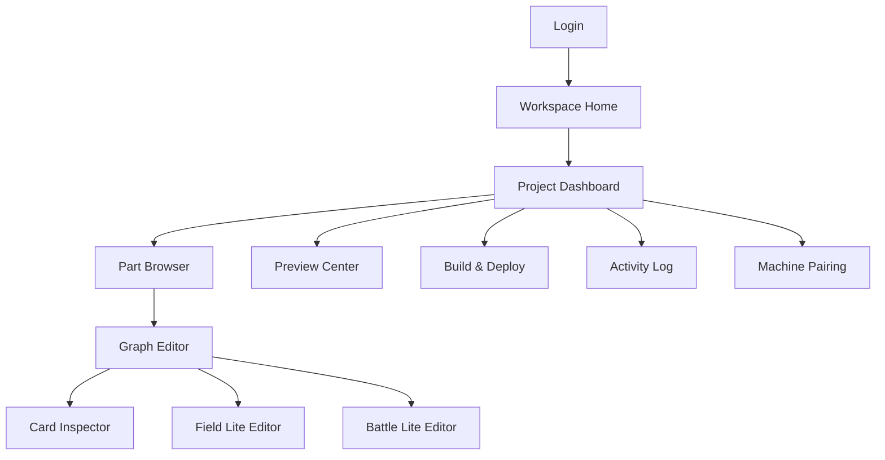

# Web SaaS Studio 화면 상세 명세
작성일: 2026-04-09  
상태: Draft / UX 상세 명세  
연결 문서: [unity_single_mode_studio_playable_architecture_masterplan_2026-04-09.md](./unity_single_mode_studio_playable_architecture_masterplan_2026-04-09.md)

## 1. 목적

이 문서는 웹 SaaS 기반 편집툴의 화면 구조와 사용자 흐름을 정의한다.

이 편집툴의 목표:

- 어디서든 part/card 구조를 수정 가능하게 한다.
- 경량 시각화 편집과 검수/승인/프리뷰를 가능하게 한다.
- 실제 Unity 고급 편집과 빌드/배포는 로컬 에이전트 및 Unity 쪽에 위임한다.

## 2. 제품 포지션

웹 SaaS Studio는 "모든 제작을 웹에서 끝내는 엔진"이 아니다.  
그보다는 아래 역할에 특화된 컨트롤 타워다.

- 구조 편집
- 메타데이터 편집
- 경량 배치 편집
- 프리뷰/빌드/배포 요청
- 작업 승인
- 운영 로그 확인

## 3. 사용자 역할

### `viewer`

- 프로젝트 조회
- 그래프 조회
- 프리뷰 조회

### `editor`

- 카드/대사/연결 수정
- 경량 필드 편집
- 프리뷰 요청

### `advanced_editor`

- 웹상 메타데이터 수정 + Unity 고급 편집 수행

### `publisher`

- 빌드 요청
- 배포 승인
- 릴리스 메모 작성

### `admin`

- 권한/프로젝트/머신 매핑 관리

## 4. 정보 구조

## 5. 공통 UX 원칙

1. 데스크톱 우선
2. 태블릿 접근 가능
3. 모바일은 조회/승인 중심
4. 그래프와 인스펙터가 항상 같이 보여야 함
5. 저장 상태가 항상 명확해야 함
6. 로컬 머신 연결 상태가 항상 보여야 함

## 6. 핵심 화면 명세

## 6.1 로그인 / 진입 화면

### 목적

- 사용자 인증
- 최근 프로젝트 진입

### 주요 컴포넌트

- 로그인 버튼
- 최근 프로젝트 목록
- 최근 연결 머신 상태
- 공지/버전 배너

### 주요 액션

- 로그인
- 최근 프로젝트 열기
- 새 프로젝트 신청 또는 선택

## 6.2 Workspace Home

### 목적

- 사용 가능한 프로젝트와 연결 가능한 로컬 머신 목록 확인

### 주요 컴포넌트

- 프로젝트 카드 리스트
- 최근 작업 리스트
- 머신 상태 카드
- 알림 피드

### 주요 액션

- 프로젝트 열기
- 머신 연결
- 최근 PR 보기

## 6.3 Project Dashboard

### 목적

- 프로젝트 전반의 상태를 한눈에 본다.

### 주요 컴포넌트

- 현재 브랜치
- 현재 콘텐츠 버전
- 최근 프리뷰 빌드
- 최근 Android/iOS 빌드
- 최근 배포 이력
- 미검수 변경 수
- part 진행 현황

### 주요 액션

- Part Browser 진입
- 최근 실패 빌드 열기
- 프리뷰 링크 복사
- 배포 대시보드 이동

### 상태 뱃지

- `machine connected`
- `preview ready`
- `build running`
- `deploy blocked`
- `validation failed`

## 6.4 Part Browser

### 목적

- 프로젝트 전체 part 구조를 탐색한다.

### 주요 컴포넌트

- part 리스트
- part 검색
- 태그 필터
- 진행 상태 컬럼

### 주요 액션

- part 생성
- part 이름 수정
- part 복제
- part 보관 처리
- Graph Editor 열기

## 6.5 Graph Editor

이 화면이 웹 SaaS Studio의 핵심이다.

### 목적

- 카드 간 흐름을 시각적으로 설계한다.

### 레이아웃

- 좌측: Part Tree / Card Library
- 중앙: Graph Canvas
- 우측: Selected Card Inspector
- 하단: Validation / Diff / Notes 탭

### 주요 기능

- 카드 노드 생성
- 노드 드래그 배치
- 연결선 생성/삭제
- 분기 조건 표시
- entry card 표시
- dead end 표시
- 순환 경고
- 미저장 변경 강조

### 노드 타입별 시각 차이

- `scen_card`: 보라/서사 색상
- `safe_field_card`: 초록/안전 필드 색상
- `battle_field_card`: 빨강/전투 색상
- `tutorial_card`: 파랑/가이드 색상
- `branch_card`: 노랑/조건 분기 색상

### 주요 액션

- 카드 추가
- 카드 연결
- 카드 삭제
- 카드 복제
- 해당 카드 프리뷰
- Unity에서 열기 요청

### 검증 표시

- 빨간 배지: 오류
- 노란 배지: 경고
- 파란 배지: 참고

## 6.6 Card Inspector

### 목적

- 선택된 카드의 상세 속성을 편집한다.

### 공통 섹션

- 기본 정보
  - ID
  - 제목
  - 설명
  - 태그
- 진입/종료
  - entryConditions
  - next
  - branches
- 미리보기
  - previewStart
  - reset flags

### 타입별 섹션

#### `scen_card`

- timelineRef
- dialogueSetRef
- audioProfileRef
- backgroundRef
- inputLock
- skippable

#### `safe_field_card`

- fieldRef
- spawnPointId
- interactionSetRef
- housingEnabled

#### `battle_field_card`

- fieldRef
- encounterRef
- allowRetry
- winNext
- loseNext

### 주요 액션

- 저장
- 변경 취소
- diff 보기
- JSON 보기

## 6.7 Field Lite Editor

### 목적

- 웹에서 가능한 범위의 경량 배치 편집을 수행한다.

### 주요 컴포넌트

- 배경 캔버스
- 레이어 토글
- 오브젝트 리스트
- 좌표 인스펙터
- 스폰 영역 툴바

### 주요 액션

- 오브젝트 포인트 이동
- NPC 위치 이동
- 스폰 박스 생성/이동/크기조절
- 트리거 포인트 배치

### 제한

- 픽셀 단위 정밀 충돌 편집 없음
- 타일맵 편집 없음
- 복잡한 경로 편집 없음

## 6.8 Battle Lite Editor

### 목적

- 웹에서 웨이브와 보스 구조를 빠르게 편집한다.

### 주요 컴포넌트

- 웨이브 목록
- 몬스터 선택 드로어
- 보스 플래그
- spawn area 선택
- 승패 조건 패널

### 주요 액션

- 웨이브 추가/삭제/재정렬
- 몬스터 종류/수량 조정
- 보스 지정
- 웨이브 지연시간 조정
- Web Preview 요청

## 6.9 Preview Center

### 목적

- 프리뷰 요청과 결과를 관리한다.

### 주요 컴포넌트

- 연결된 머신 선택
- 실행 모드 선택
  - card
  - part
  - checkpoint
- 실행 옵션
  - reset save
  - reset tutorial
  - locale
- 최근 프리뷰 기록
- 로그 패널

### 주요 액션

- 로컬 프리뷰 실행
- Web Preview 생성
- 최근 프리뷰 다시 열기
- 실패 로그 복사

## 6.10 Build & Deploy Dashboard

### 목적

- 빌드와 배포 상태를 관리한다.

### 주요 컴포넌트

- 대상 선택
  - web preview
  - android internal
  - ios internal
- 버전 입력
- 릴리스 노트
- 진행률 바
- 산출물 카드

### 주요 액션

- Android 빌드 요청
- iOS 빌드 요청
- Firebase Preview 배포
- 산출물 링크 복사
- 재배포

## 6.11 Activity Log

### 목적

- 누가 무엇을 바꿨는지 추적한다.

### 주요 컴포넌트

- 시간순 이벤트 피드
- 사용자 필터
- 파일 필터
- 이벤트 타입 필터

### 이벤트 예시

- 카드 수정
- 연결 변경
- 프리뷰 요청
- 빌드 시작/완료
- 배포 완료/실패

## 6.12 Machine Pairing 화면

### 목적

- 로컬 워크스페이스 에이전트를 연결한다.

### 주요 컴포넌트

- 페어링 코드 입력
- 연결된 머신 목록
- 머신 상태
- 현재 브랜치/워크스페이스 정보

### 주요 액션

- 새 머신 연결
- 머신 이름 변경
- 기본 머신 지정
- 연결 해제

## 7. 핵심 사용자 흐름

## 7.1 기획자가 카드 흐름 수정 후 로컬 프리뷰

1. Project Dashboard 진입
2. Part Browser에서 part 선택
3. Graph Editor에서 카드 연결 수정
4. Card Inspector에서 설명/대사 참조 수정
5. Preview Center에서 `이 카드부터 실행`
6. Local Agent가 프리뷰 실행
7. 로그와 결과 확인

## 7.2 디자이너가 웹에서 웨이브 구조 수정 후 Unity 정밀 편집

1. Battle Lite Editor에서 웨이브 순서 조정
2. Preview Center에서 Web Preview 생성
3. 이상 발견 시 `Unity에서 열기 요청`
4. 로컬 Unity Advanced Studio에서 정밀 조정
5. 다시 프리뷰

## 7.3 퍼블리셔가 내부 테스트 빌드 배포

1. Build & Deploy Dashboard 열기
2. Android internal 선택
3. 버전/노트 입력
4. 빌드 요청
5. 결과물 확인 후 테스트 그룹에 공유

## 8. 공통 UX 상태

### 저장 상태

- `Saved`
- `Unsaved changes`
- `Saving...`
- `Save failed`

### 검증 상태

- `Valid`
- `Warning`
- `Error`

### 머신 상태

- `Connected`
- `Disconnected`
- `Busy`
- `Outdated`

## 9. 반응형 정책

### 데스크톱

- 전체 편집 가능
- 그래프 + 인스펙터 동시 표시

### 태블릿

- 그래프 편집 가능
- 경량 인스펙터 가능
- 배포 승인 가능

### 모바일

- 조회/승인 중심
- 긴급 수정은 제한
- 그래프 편집은 read-mostly

## 10. 실패/예외 UX

### 머신 미연결

- 프리뷰/빌드 버튼 비활성화
- 연결 유도 배너 표시

### 검증 실패

- Graph Editor 하단 패널에 오류 리스트 표시
- 해당 노드로 점프 가능

### 빌드 실패

- Build Dashboard에 실패 단계 표시
- 로그 다운로드
- 재시도 버튼 표시

## 11. 추적 이벤트

필수 이벤트:

- `part_opened`
- `card_selected`
- `graph_link_created`
- `preview_requested`
- `build_requested`
- `deploy_requested`
- `validation_failed`

목적:

- 편집툴 사용성 개선
- 병목 지점 파악
- 어떤 기능이 실제로 많이 쓰이는지 분석

## 12. 1차안 / 2차안 화면 범위

### 1차안 필수 화면

- Login
- Workspace Home
- Project Dashboard
- Part Browser
- Graph Editor
- Card Inspector
- Preview Center
- Machine Pairing

### 2차안 확장 화면

- Field Lite Editor
- Battle Lite Editor
- Build & Deploy Dashboard
- Activity Log

## 13. 구현 우선순위

1. Graph Editor
2. Card Inspector
3. Preview Center
4. Machine Pairing
5. Project Dashboard
6. Field Lite Editor
7. Battle Lite Editor
8. Build & Deploy Dashboard

