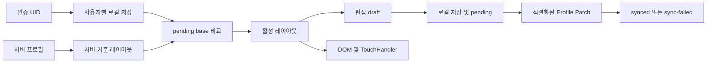

# UI 설정 구조 및 검증 범위

서버 기준은 `uiLayoutServerBase`, 로컬은 `yurika_ui_layout_v2:UID`, draft는 `uiLayoutDraft`, 활성 레이아웃은 `localPlayer.uiLayout`이다. UID 변경 시 draft/활성 레이아웃/조이스틱/sync generation을 초기화한다. 같은 UID 인증 이벤트에는 초기화하지 않는다.

기존 전역 키는 인증 후 첫 사용자에게 한 번 귀속한다. 원래 소유자를 역추적할 정보가 없어 귀속이 불확실하며 로그인 전 이관/원격 저장은 금지한다. 기존 version 1과 정규화 left/top/scale은 유지한다. 최상위 `joystickMode=dynamic|fixed`를 추가하고 누락값은 dynamic이다. 화면 방향별 위치는 기존 layouts.mobilePortrait/mobileLandscape.joystick에 남는다.

충돌 해결은 기기 시각 대신 서버 우선이다. `:pending`에 base와 후보 layout(null 포함)을 기록하고, base와 서버가 같을 때만 자동 재시도한다. 다르면 서버를 표시하고 `:conflict`에 로컬 변경을 보존하며 자동 업로드를 막는다. 별도 revision CAS와 양쪽 선택·복구 UI는 후속이다. 기존 프로필 revision/writer-session 트랜잭션은 유지했다.

저장 흐름은 idle → saved-local → syncing → synced/sync-failed이며 설정창에서 실패 상태와 재시도 버튼을 제공한다. 초기화는 편집창 draft만 변경하고 저장/취소로 결정한다. 추가 확인 모달과 Undo는 구현하지 않았다.

공통 ViewportMetrics는 game-viewport 크기·offset, visualViewport fallback, safe inset, DPR, 방향, 입력 방식을 제공한다. 캔버스 크기와 편집 capture/drag/apply가 이를 사용한다. fixed DOM 좌표에는 컨테이너 offset을 더하고 저장할 때 뺀다. 튜토리얼/팝업의 모든 좌표 함수까지 일괄 이전하지 않았다. 노치·소프트 키보드는 실기기 검증이 남는다.

카메라는 rAF당 미리보기 한 번, change에서 최종값 저장만 한다. 실제 앱에서 input 30회에 resize 0회/backing setter 0회/persist 1회를 확인했다. backing 크기가 같으면 캔버스 할당을 생략한다.

입력 수명주기: Keyboard attach → 물리키 액션 map → blur/hidden/reset → cleanup. Touch _listen → disposer 목록 → cancel/resetState → cleanup. 기존 InputManager 이벤트 전달은 유지한다.

PWA는 version fetch → ok/형식 검사 → 정상 mismatch 시 registration.update → install의 shell 다운로드 → activate의 앱 캐시 정리 → 기존 controllerchange reload guard 순이다. 불명 버전은 캐시 삭제·재시작하지 않는다. 기존 수동/legacy 복구 경로는 유지했다.

검증 정책 변경: 이전 정적 검사의 전역 키 강제·UID helper 금지, 즉시 초기화 저장 문구 요구, 5개 지연 타이머 강제 조건은 잘못된 동작을 고정했다. A/B 저장, draft 초기화, rAF 병합의 실제 메서드 테스트를 추가하고 해당 정적 조건만 변경했다.

구현과 테스트:

- [UIManager](C:/dev/yurika_online/src/js/ui/UIManager.js:1)
- [ViewportMetrics](C:/dev/yurika_online/src/js/core/ViewportMetrics.js:1)
- [게임 크기·카메라](C:/dev/yurika_online/src/js/main.js:1)
- [동작 테스트](C:/dev/yurika_online/scripts/validate-improvement.mjs:1)
- [브라우저 테스트](C:/dev/yurika_online/scripts/browser-tests/improvement.spec.cjs:1)
